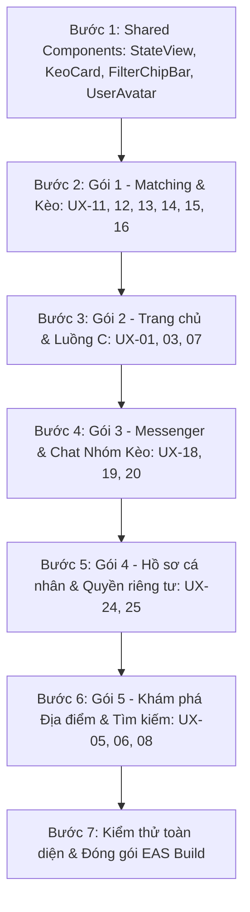

# KẾ HOẠCH NÂNG CẤP TOÀN DIỆN GIAO DIỆN VIVU (UI/UX OVERHAUL PLAN)

> **Căn cứ tài liệu đặc tả chuẩn:**
> - [`docs/VIVU_UI_UX_GUIDELINES.md`](file:///d:/vivudemo1/docs/VIVU_UI_UX_GUIDELINES.md) (Đặc tả UI/UX tổng thể)
> - [`docs/VIVU_MATCHING_FUNCTIONAL_SPEC.md`](file:///d:/vivudemo1/docs/VIVU_MATCHING_FUNCTIONAL_SPEC.md) (Đặc tả Matching & Kèo cốt lõi)
> - [`docs/HOME_FUNCTIONAL_SPEC.md`](file:///d:/vivudemo1/docs/HOME_FUNCTIONAL_SPEC.md), [`AUTH_FUNCTIONAL_SPEC.md`](file:///d:/vivudemo1/docs/AUTH_FUNCTIONAL_SPEC.md), [`INFRASTRUCTURE_SPEC.md`](file:///d:/vivudemo1/docs/INFRASTRUCTURE_SPEC.md), [`VIVU_SRS.md`](file:///d:/vivudemo1/docs/VIVU_SRS.md)
>
> **Tôn chỉ sản phẩm:** *"Muốn đi đâu, Vivu tìm người đi cùng."* Kèo là đơn vị kết nối chính, Matching là trải nghiệm trọng tâm. Tuyệt đối không dùng dữ liệu giả (fake data), không dùng swipe hồ sơ kiểu hẹn hò, ưu tiên thông tin rõ ràng trước cảm xúc.

---

## 1. Phân tích hiện trạng mã nguồn cũ & Lý do thay thế toàn diện (Clean Overhaul)

| Màn hình cũ | Hiện trạng mã nguồn | Vấn đề so với Đặc tả mới | Quyết định xử lý |
|---|---|---|---|
| **`MatchHomeScreen.tsx`** | 1.206 dòng, chứa mock swipe card hẹn hò Tinder, danh sách ứng viên hardcode | Vi phạm nguyên tắc cốt lõi: *"Matching không dùng swipe hồ sơ làm cơ chế chính. Đơn vị matching là kèo (hoạt động, giờ, địa điểm, số chỗ)"*. | **Viết mới 100% (UX-11, UX-12):** Danh sách & Bản đồ kèo thật, thẻ kèo chuẩn thông tin, bộ lọc đa năng. |
| **`HomeFeedScreen.tsx`** | 1.139 dòng, logic cồng kềnh, styling nặng nề, bình luận giả | Thiếu Luồng C (*"Rủ đi cùng" từ bài viết để chuyển thành kèo*), giao diện chưa theo bảng màu chuẩn. | **Viết mới 100% (UX-01):** Bảng tin sạch sẽ, gọi API thật, có nút "Rủ đi cùng" prefill ngữ cảnh. |
| **`CreatePostScreen.tsx` & Tạo kèo** | Trộn lẫn tạo bài viết với tạo hoạt động, form dài dòng | Đặc tả yêu cầu: Biểu mẫu tạo kèo (Luồng B) phải ngắn gọn, validate giờ tương lai tại trường, có màn hình xem trước (preview). | **Tách biệt và viết mới:** Màn hình Tạo kèo chuẩn (`UX-13`) và Tạo bài viết (`UX-03`). |
| **`PersonalChatScreen.tsx` & Messenger** | 900+ dòng, gọi hàm impure `Date.now()`, smart reply hardcode | Thiếu Chat nhóm kèo có ghim kế hoạch (`UX-20`), chưa phân chia danh sách hội thoại (`UX-18`). | **Viết mới 100% (UX-18, UX-19, UX-20):** Socket.io realtime, ghim điểm hẹn/giờ, phân quyền sau khi duyệt. |
| **`ProfileScreen.tsx`** | 1.148 dòng, nhiều modal và tabs giả lập | Cần tinh gọn theo `UX-24` & `UX-25`: Hiển thị Điểm Uy Tín (Trust Score), Kèo đã tham gia, bảo vệ quyền riêng tư. | **Viết mới tinh gọn (UX-24, UX-25):** Hồ sơ minh bạch, giao diện ấm áp, hỗ trợ chỉnh sửa và quyền riêng tư. |
| **`MapScreen.tsx`** | 2.820 dòng, logic quá nặng, mapbox/web xung đột | Cần chuẩn hóa theo `UX-06` (Khám phá địa điểm) và `UX-11` (Matching bản đồ) với dữ liệu Đà Nẵng thật. | **Tái cấu trúc thành 2 module gọn nhẹ:** Bản đồ Kèo (`UX-11`) và Khám phá địa điểm (`UX-06/08`). |

---

## 2. Kiến trúc Giao diện mới (Clean Component Architecture)

### 2.1. Thư viện Component dùng chung (Shared UI Atoms & Molecules)
Xây dựng trước tại `src/components/common/` để tái sử dụng xuyên suốt toàn bộ ứng dụng:

1. **`StateView.tsx` (Xử lý 3 trạng thái chuẩn mục 9 đặc tả):**
   - `LoadingSkeleton`: Hiển thị khung xương (skeleton) theo bố cục thực tế, không dùng spinner khóa màn hình.
   - `EmptyState`: Minh bạch lý do trống dữ liệu + một nút CTA rõ ràng để tiếp tục.
   - `ErrorState`: Thông báo lỗi lịch sự + nút "Thử lại" và bảo toàn dữ liệu nhập dở.
2. **`KeoCard.tsx` (Thẻ Kèo chuẩn Luồng A):**
   - Tên hoạt động nổi bật, icon danh mục.
   - Giờ & Ngày cụ thể (dễ quét nhanh).
   - Địa điểm công cộng, khoảng cách ước tính.
   - Số chỗ: `Còn X/Y chỗ` (hiển thị chip màu Mint nếu còn chỗ, xám nếu đã đủ).
   - Chủ kèo: Avatar + Tên + Điểm Uy Tín (`Trust Score`).
   - 1-2 lý do phù hợp (vd: *"Cùng mê cafe"*, *"Gần khu vực bạn chọn"*).
   - Nút CTA chính: **"Tham gia kèo"** (hoặc trạng thái "Chờ duyệt" nếu đã gửi).
3. **`FilterChipBar.tsx` (Thanh lọc chuẩn mục 4.4):**
   - Lọc theo thời gian (Hôm nay, Ngày mai, Cuối tuần).
   - Lọc theo bán kính / Khu vực.
   - Lọc theo danh mục hoạt động (Ăn uống, Du lịch, Cafe, Thể thao, Camping).
   - Hiển thị rõ số lượng bộ lọc đang áp dụng và nút xóa bộ lọc.
4. **`UserAvatar.tsx`:**
   - Avatar người dùng thật, initials khi không có ảnh, huy hiệu xác minh Mint, vòng tròn Trust Score.
5. **`PlanPinnedHeader.tsx`:**
   - Thanh ghim thông tin cuộc hẹn (Hoạt động, Giờ hẹn, Điểm gặp, Số thành viên) ở đầu phòng Chat nhóm kèo (`UX-20`).

---

## 3. Lộ trình Thực thi chi tiết theo 6 Gói Màn hình (Work Breakdown)

### 🚀 Gói 1: Trọng tâm Cốt lõi — Đi cùng / Matching (P0 - W7)
*Thực thi Luồng A (Tìm & Tham gia kèo) và Luồng B (Tạo kèo)*

- [x] **Bước 1.1: Màn hình Danh sách Kèo & Bản đồ Kèo (UX-11, UX-12)**
  - File: `src/screens/match/MatchHomeScreen.tsx`
  - Kết nối API `GET /api/activities?city=...&category=...`
  - Tích hợp `KeoCard` và `FilterChipBar`.
  - Xử lý Loading Skeleton, Empty State (*"Chưa có kèo nào quanh bạn..."*), Error State.
- [x] **Bước 1.2: Màn hình Chi tiết Kèo (UX-14)**
  - File: `src/screens/match/ActivityDetailScreen.tsx` (Route: `activity/[id].tsx`)
  - Kết nối API `GET /api/activities/:id`
  - Hiển thị: Chủ kèo (Trust Score), kế hoạch chi tiết, địa điểm công cộng an toàn, danh sách thành viên (UX-10).
  - Khối hướng dẫn an toàn gặp mặt nơi công cộng.
  - CTA chính duy nhất: **"Gửi yêu cầu tham gia"** kèm modal nhập lời chào.
- [x] **Bước 1.3: Màn hình Tạo Kèo chuẩn Luồng B (UX-13) & Tạo bài viết (UX-03)**
  - File: `src/screens/feed/CreatePostScreen.tsx` (Route: `create_post.tsx`)
  - Form ngắn gọn 4 bước: Hoạt động -> Giờ hẹn (validate cấm giờ quá khứ) -> Điểm hẹn công cộng Đà Nẵng -> Số chỗ tối đa & kinh phí.
  - Màn hình Xem trước (Preview) thông tin kèo trước khi xuất bản.
  - Gọi API `POST /api/activities` -> Tạo xong chuyển hướng xem chi tiết kèo.
- [x] **Bước 1.4: Màn hình Quản lý Kèo & Duyệt Thành viên (UX-15, UX-16)**
  - File: `src/screens/match/ParticipantListScreen.tsx`
  - Chủ kèo xem danh sách ứng viên đang chờ duyệt (gồm avatar, Trust Score, lời nhắn).
  - Nút "Chấp nhận" hoặc "Từ chối" -> Tự động kích hoạt nhóm chat.

---

### 🚀 Gói 2: Bảng tin Trang chủ & Luồng C — Từ Nội dung sang Kèo (P0/P1 - W9)
*Thực thi Luồng C (Từ bài viết / địa điểm -> Tạo kèo có điền sẵn ngữ cảnh)*

- [x] **Bước 2.1: Viết mới Trang chủ (UX-01 - Home Feed)**
  - File: `src/screens/feed/HomeFeedScreen.tsx` (Route: `(tabs)/index.tsx`)
  - Kết nối API `GET /api/feed/posts` và `GET /api/activities`.
  - Hiển thị Kèo nổi bật đang tìm cạ gấp + Feed bài viết thật từ cộng đồng.
  - Nút CTA ngữ cảnh đặc trưng của Vivu: **"Rủ đi cùng"** chuyển sang Luồng C.
- [x] **Bước 2.2: Luồng C — Prefill ngữ cảnh sang Tạo Kèo**
  - Khi bấm "Rủ đi cùng" tại bài viết: Tự động mở màn hình Tạo Kèo (`UX-13`) với địa điểm và danh mục đã được điền sẵn.
- [x] **Bước 2.3: Viết mới Chi tiết bài viết & Bình luận (UX-07)**
  - File: `src/screens/feed/PostDetailScreen.tsx` (Route: `post_detail.tsx`)
  - Kết nối API `ApiClient.createComment`, bình luận thật, tương tác Like, nút "Rủ đi cùng tại đây".
- [x] **Bước 2.4: Viết mới Đăng bài viết (UX-03)**
  - File: `src/screens/feed/CreatePostScreen.tsx` (Tab "Bài viết")
  - Đăng cảm nghĩ, tải ảnh thật từ thư viện, gắn thẻ địa điểm.

---

### 🚀 Gói 3: Messenger & Chat Nhóm Kèo Realtime (P0 - W8)
*Xác nhận kế hoạch và điều phối gặp mặt an toàn*

- [ ] **Bước 3.1: Viết mới Danh sách Messenger (UX-18)**
  - File: `src/screens/messages/MessageHomeScreen.tsx` (Route: `(tabs)/messages.tsx`)
  - Kết nối API `GET /api/chat/conversations`.
  - Tab 1: **"Nhóm kèo"** (Hiển thị các kèo đã được duyệt, ưu tiên kèo sắp diễn ra).
  - Tab 2: **"Tin nhắn riêng"** (Trò chuyện 1-1).
  - Trạng thái tin chưa đọc, thời gian thực tế, preview tin nhắn mới nhất.
- [ ] **Bước 3.2: Viết mới Chat Nhóm Kèo (UX-20)**
  - File: `src/screens/messages/GroupChatScreen.tsx` (Route: `group_chat.tsx`)
  - Tích hợp `PlanPinnedHeader`: Ghim địa điểm, giờ hẹn, danh sách thành viên ở trên cùng.
  - Socket.io realtime chat (gửi nhận tin tức thì, hỗ trợ hình ảnh, thông báo hệ thống khi chủ kèo cập nhật lịch).
  - Chỉ thành viên đã được duyệt mới có quyền truy cập.
- [ ] **Bước 3.3: Viết mới Chat Riêng & Tính năng An toàn (UX-19)**
  - File: `src/screens/messages/PersonalChatScreen.tsx` (Route: `personal_chat.tsx`)
  - Nhắn tin 1-1 realtime qua Socket.io.
  - Các nút an toàn dễ tìm: **Báo cáo người dùng**, **Chặn**, **Rời cuộc trò chuyện**.

---

### 🚀 Gói 4: Hồ sơ Cá nhân, Uy tín & Quyền riêng tư (P0/P1 - W9)
*Giúp đánh giá mức độ tin cậy mà không phơi bày dữ liệu nhạy cảm*

- [ ] **Bước 4.1: Viết mới Trang cá nhân (UX-24)**
  - File: `src/screens/profile/ProfileScreen.tsx` (Route: `(tabs)/profile.tsx`)
  - Kết nối API `GET /api/profile/me` hoặc `GET /api/profile/:id`.
  - Hiển thị: Avatar, Tên, Bio, Khu vực sinh sống, Sở thích cá nhân.
  - **Điểm Uy Tín (Trust Score):** Thể hiện qua các tiêu chí khách quan (xác minh số điện thoại, tham gia kèo đúng hẹn, phản hồi tích cực).
  - Tab: "Kèo đã tham gia" & "Bài viết đã đăng".
- [ ] **Bước 4.2: Sửa hồ sơ & Thiết lập Quyền riêng tư (UX-25, `privacy_setting`)**
  - File: `src/screens/profile/EditProfileScreen.tsx` & `PrivacySettingScreen.tsx`
  - Tùy chọn ẩn/hiện số điện thoại, ẩn vị trí chính xác (chỉ hiện quận/thành phố).
  - Đăng xuất an toàn, xóa phiên đăng nhập.

---

### 🚀 Gói 5: Khám phá Địa điểm & Tìm kiếm Đa năng (P0/P1 - W7/W9)

- [ ] **Bước 5.1: Khám phá Địa điểm Đà Nẵng (UX-06, UX-08)**
  - File: `src/screens/discovery/PlaceDiscoveryScreen.tsx` & `PlaceDetailScreen.tsx`
  - Dữ liệu địa điểm ẩm thực, cafe, du lịch Đà Nẵng thật từ CSDL backend (`GET /api/places`).
  - Nút CTA nổi bật: **"Tạo kèo tại đây"** -> Chuyển ngay sang form Tạo kèo với thông tin quán đã điền sẵn.
- [ ] **Bước 5.2: Tìm kiếm Đa năng (UX-05)**
  - File: `src/screens/discovery/SearchScreen.tsx`
  - Ô tìm kiếm phân loại kết quả rõ ràng theo 4 tab: **Kèo đang mở** | **Địa điểm** | **Bài viết** | **Người dùng**.

---

### 🚀 Gói 6: Đăng nhập, Đăng ký & Onboarding chuẩn (P0 - W6)

- [ ] **Bước 6.1: Đăng nhập & Đăng ký (UX-00)**
  - File: `src/screens/onboarding/LoginScreen.tsx` & `RegisterScreen.tsx`
  - Giao diện tối giản, CTA duy nhất rõ ràng.
  - Không bắt buộc cấp quyền vị trí nếu chưa cần.
  - Nhập số điện thoại/email -> nhận OTP thật -> xác minh.
- [ ] **Bước 6.2: Khởi tạo Sở thích & Khu vực**
  - Chọn thành phố (mặc định Đà Nẵng), chọn 3 sở thích chính để hệ thống tính điểm phù hợp (Matching score).

---

## 4. Thứ tự Triển khai (Execution Sequence)

Mỗi bước khi thực hiện xong một gói màn hình:
1. Chạy `npx tsc --noEmit` và `npx expo lint` để đảm bảo code sạch 100%.
2. Kiểm tra trực quan trên **Expo Go** (Android/iOS) và Web.
3. Đánh dấu `[x]` vào checklist trong `IMPLEMENTATION_PLAN.md`.
