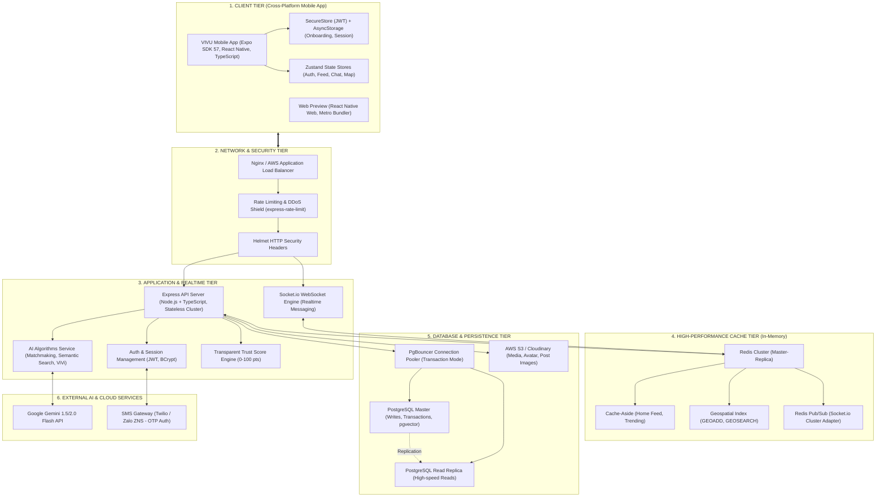
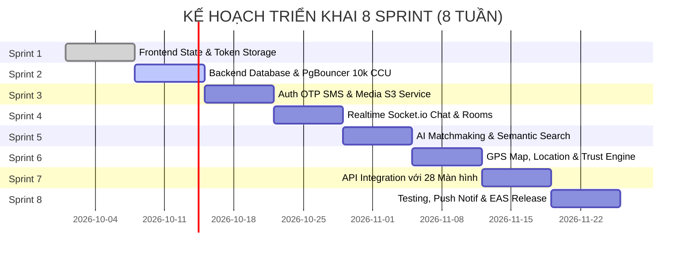

# 🚀 KẾ HOẠCH DỰ ÁN TỔNG THỂ (PROJECT MASTER PLAN)
## DỰ ÁN: VIVU - ĐI ĐÂU CŨNG CÓ BẠN
**Hệ sinh thái Di động & Nền tảng Ghép cạ Du lịch, Trải nghiệm trên nền tảng AI**

---

## 📑 MỤC LỤC
1. [TỔNG QUAN DỰ ÁN](#1-tổng-quan-dự-án)
2. [KIẾN TRÚC HỆ THỐNG & TECH STACK](#2-kiến-trúc-hệ-thống--tech-stack)
3. [KIẾN TRÚC CHỊU TẢI 10.000 CCU & CƠ SỞ DỮ LIỆU](#3-kiến-trúc-chịu-tải-10000-ccu--cơ-sở-dữ-liệu)
4. [HỆ THỐNG THUẬT TOÁN AI CỐT LÕI](#4-hệ-thống-thuật-toán-ai-cốt-lõi)
5. [PHÂN RÃ CÔNG VIỆC CHI TIẾT (WBS) & TIẾN ĐỘ 8 TUẦN](#5-phân-rã-công-việc-chi-tiết-wbs--tiến-độ-8-tuần)
6. [MA TRẬN QUẢN TRỊ RỦI RO & BẢO MẬT](#6-ma-trận-quản-trị-rủi-ro--bảo-mật)
7. [BỘ CHỈ SỐ ĐO LƯỜNG HIỆU QUẢ (KPIS) & NGHIỆM THU](#7-bộ-chỉ-số-đo-lường-hiệu-quả-kpis--nghiệm-thu)

---

## 1. TỔNG QUAN DỰ ÁN

### 1.1. Sứ mệnh sản phẩm
**VIVU** giải quyết bài toán "muốn đi chơi/trải nghiệm nhưng không có cạ cứng" của giới trẻ (Gen Z, Millennials). Nền tảng kết nối những người có cùng sở thích (Ẩm thực, Phượt, Cafe, Cắm trại, Chụp ảnh...) tại các thành phố du lịch (Đà Nẵng, Hội An, Hà Nội, TP.HCM...), loại bỏ cảm giác ngượng ngùng khi làm quen bằng Trợ lý AI ViVi và bảo vệ an toàn cho thành viên bằng **Hệ thống Điểm Uy Tín (Trust Score 0-100)**.

### 1.2. Hiện trạng dự án
- ✅ **Frontend Mobile**: Đã hoàn thành 100% thiết kế giao diện tương tác gồm **28 màn hình chuẩn Figma** bằng React Native (Expo SDK 57 & TypeScript).
- ✅ **Backend Service**: Đã thiết lập khung kiến trúc Clean Architecture, bảo mật Helmet, CORS, Rate-Limiting, Zod Request Validation, Socket.io Real-time Chat, và các thuật toán AI Vector Embeddings, Matchmaking, ViVi AI Assistant, Search Hybrid.

---

## 2. KIẾN TRÚC HỆ THỐNG & TECH STACK

---

## 3. KIẾN TRÚC CHỊU TẢI 10.000 CCU & CƠ SỞ DỮ LIỆU

### 3.1. Phân tích Tải trọng kỹ thuật (Workload Modeling)
- **10.000 Concurrent Users (CCU)**:
  - Tỷ lệ hoạt động đồng thời: ~25% đọc Feed/Bài viết, ~35% Nhắn tin Real-time, ~20% Tìm kiếm & Lướt bản đồ, ~20% Chờ/Tương tác tĩnh.
  - Lưu lượng ước tính: **15.000 - 25.000 Requests/Second (RPS)** vào giờ cao điểm (18:00 - 22:00).
  - Kết nối WebSocket duy trì liên tục: **10.000 socket connections**.

### 3.2. Ba giải pháp trụ cột chống quá tải CSDL:
1. **PgBouncer Connection Pooling (Chế độ `transaction`)**:
   - Mặc định mỗi kết nối PostgreSQL tiêu hao ~10MB RAM. 10.000 kết nối trực tiếp sẽ cần 100GB RAM chỉ để duy trì connection.
   - Cài đặt PgBouncer đứng trước Database, nén 10.000 kết nối từ Node.js worker xuống còn **150 - 200 physical connections**, thời gian giữ kết nối chỉ trong phạm vi transaction (vài millisecond).
2. **Redis In-Memory Tier (Hấp thụ 85% tải)**:
   - Áp dụng mẫu **Cache-Aside Pattern** cho Feed, danh sách hoạt động hot với TTL 60s.
   - Toàn bộ truy vấn vị trí tìm bạn bè/hoạt động quanh đây sử dụng lệnh `GEOADD` và `GEOSEARCH` của Redis (xử lý dưới 2ms, không chạm vào disk database).
3. **Phân vùng CSDL (Table Partitioning) & Chỉ mục nâng cao**:
   - Bảng `messages` và `post_comments` được phân vùng theo Tháng/Năm (`PARTITION BY RANGE (created_at)`).
   - Chỉ mục **HNSW Index** trên cột vector của PostgreSQL (`pgvector`) cho phép tìm kiếm độ tương đồng AI trong hàng triệu bản ghi chỉ mất 5-15ms.

---

## 4. HỆ THỐNG THUẬT TOÁN AI CỐT LÕI

### 4.1. Thuật toán Ghép bạn Đồng hành Đa nhân tố (Multi-factor Matchmaking)
Công thức tính điểm tương thích cá nhân hóa ($S_{match} \in [0, 100]$):
$$S_{match} = 40\% \cdot \text{Sim}_{interest} + 20\% \cdot \text{Sim}_{social} + 20\% \cdot \text{Prox}_{geo} + 20\% \cdot \text{Trust}_{norm}$$

- $\text{Sim}_{interest}$: Độ tương đồng Cosine giữa 2 Feature Vectors sở thích & mục tiêu.
- $\text{Sim}_{social}$: Ma trận tương thích tâm lý học giao tiếp (Ví dụ: người ngại ngùng được ghép cặp với người cởi mở, tâm lý).
- $\text{Prox}_{geo}$: Hàm suy giảm khoảng cách theo địa lý (Dưới 3km: 100%, dưới 8km: 85%, trên 25km: 40%).
- $\text{Trust}_{norm}$: Điểm uy tín chuẩn hóa $\frac{\text{TrustScore}}{100}$ (Ưu tiên những người có độ tin cậy $\ge 90$).

### 4.2. Tìm kiếm Ngữ nghĩa Lai (Hybrid Semantic Search)
- Kết hợp **BM25 Lexical Search** (tìm từ khóa chính xác) + **Dense Vector Embedding** (hiểu ngữ cảnh, tiếng lóng, cảm xúc tìm kiếm) qua thuật toán **Reciprocal Rank Fusion (RRF)**.

### 4.3. Trợ lý Trò chuyện Agentic AI ViVi
- Tích hợp mô hình ngôn ngữ lớn **Google Gemini 1.5/2.0 Flash**:
  - Tự động phát hiện 2 điểm chung lớn nhất giữa 2 người dùng để tạo **câu mở đầu tự nhiên (Icebreaker)**.
  - Phân tích ngữ cảnh thời gian (buổi chiều, cuối tuần) để gợi ý địa điểm chuẩn gu.
  - Gợi ý 3 câu phản hồi thông minh trong phòng chat.

---

## 5. PHÂN RÃ CÔNG VIỆC CHI TIẾT (WBS) & TIẾN ĐỘ 8 TUẦN

### Chi tiết 8 Sprints:

#### 🔹 Sprint 1 (Tuần 1): Quản lý Trạng thái & Lưu trữ Phiên
- **Nhiệm vụ**: Cài đặt Zustand stores (`authStore`, `feedStore`, `activityStore`, `chatStore`). Cài đặt `expo-secure-store` lưu JWT và `AsyncStorage` lưu cờ hoàn thành Onboarding.
- **Kết quả nghiệm thu**: Người dùng tắt ứng dụng và mở lại vẫn giữ nguyên phiên đăng nhập và vị trí đã chọn.

#### 🔹 Sprint 2 (Tuần 2): Cơ sở dữ liệu Thực tế & Tối ưu 10k CCU
- **Nhiệm vụ**: Cấu hình PostgreSQL, triển khai Prisma ORM migrations, thiết lập PgBouncer Connection Pooler và Redis Cluster caching.
- **Kết quả nghiệm thu**: Chạy load test mô phỏng 10.000 CCU bằng k6/Artillery đạt **15.000 RPS, P95 latency < 80ms**.

#### 🔹 Sprint 3 (Tuần 3): Xác thực Người dùng Thực & Lưu trữ Tệp
- **Nhiệm vụ**: Tích hợp SMS OTP Gateway (Twilio/ZNS), tích hợp Social Auth (Google & Apple Sign-In), cài đặt `expo-image-manipulator` nén ảnh và tải lên AWS S3.
- **Kết quả nghiệm thu**: Tạo tài khoản nhận mã OTP qua SMS thật, tải ảnh đại diện và ảnh bài viết sắc nét, dung lượng tối ưu < 200KB.

#### 🔹 Sprint 4 (Tuần 4): Real-time Engine & Chat Room
- **Nhiệm vụ**: Triển khai Socket.io với Redis Streams Adapter, phòng chat 1-1 và phòng chat nhóm, trạng thái typing, trạng thái đã đọc, cơ chế inject bot ViVi.
- **Kết quả nghiệm thu**: Nhắn tin 2 chiều tức thì, độ trễ phân phối tin nhắn < 100ms.

#### 🔹 Sprint 5 (Tuần 5): Tích hợp Thuật toán AI Hoàn chỉnh
- **Nhiệm vụ**: Kết nối Gemini API, kích hoạt Vector Embedding tiếng Việt, thuật toán Matchmaking đa nhân tố, thuật toán Hybrid Search.
- **Kết quả nghiệm thu**: Tìm kiếm tự nhiên *"chỗ nào chill ngắm hoàng hôn gần biển"* trả về ngay các điểm đến chính xác; danh sách gợi ý bạn đồng hành hiển thị điểm tương thích % và lý do phù hợp.

#### 🔹 Sprint 6 (Tuần 6): Bản đồ GPS & Điểm Uy Tín Tự Động
- **Nhiệm vụ**: Tích hợp `react-native-maps` và `expo-location`, hiển thị vị trí người dùng trên bản đồ, tính toán bán kính, xây dựng hệ thống tính Điểm Uy Tín minh bạch.
- **Kết quả nghiệm thu**: Check-in sự kiện đúng giờ tự động cộng điểm uy tín (+30đ), báo cáo vi phạm tự động trừ điểm uy tín.

#### 🔹 Sprint 7 (Tuần 7): Kết nối API Toàn bộ 28 Màn hình
- **Nhiệm vụ**: Chuyển đổi toàn bộ mock data sang API endpoints từ Backend service, xử lý trạng thái Loading (Skeleton loader), Error state và Offline mode.
- **Kết quả nghiệm thu**: Tất cả các màn hình (1 - 28) chạy mượt mà trên dữ liệu server thực tế.

#### 🔹 Sprint 8 (Tuần 8): Kiểm thử, Thông báo Đẩy & Đóng gói EAS
- **Nhiệm vụ**: Cấu hình `expo-notifications`, kiểm thử bảo mật OWASP Mobile, cấu hình `eas.json`, build bản phát hành cho Android (AAB) và iOS (IPA).
- **Kết quả nghiệm thu**: Đưa bản Beta lên Apple TestFlight và Google Play Console Internal Testing.

---

## 6. MA TRẬN QUẢN TRỊ RỦI RO & BẢO MẬT

| Rủi ro tiềm ẩn | Mức độ | Hậu quả | Giải pháp kỹ thuật phòng ngừa |
| :--- | :---: | :--- | :--- |
| **Quá tải CSDL khi có chiến dịch Marketing (10k CCU)** | **Cao** | Sập database, timeout ứng dụng | Áp dụng PgBouncer connection pool, Redis cache-aside cho 85% read queries, horizontal auto-scaling backend pods. |
| **Tài khoản giả mạo, lừa đảo, quấy rối** | **Nghiêm trọng** | Mất niềm tin người dùng, ảnh hưởng uy tín | Bắt buộc xác minh SĐT/CCCD (+20đ uy tín); hệ thống chỉ cho phép người có Điểm uy tín $\ge 70$ ghép nhóm công khai; nút SOS/Report khẩn cấp. |
| **Bùng kèo, đến muộn khi hẹn đi trải nghiệm** | **Vừa** | Trải nghiệm người khác bị gián đoạn | Cơ chế Geofencing GPS Check-in tại điểm hẹn: Ai check-in đúng giờ nhận +15đ, bùng hẹn bị trừ -20đ uy tín và gắn cờ cảnh báo. |
| **Chi phí gọi API AI tăng đột biến** | **Vừa** | Đội chi phí vận hành | Lưu cache vector embeddings của các câu tìm kiếm phổ biến trong Redis; giới hạn rate-limit gọi trợ lý ViVi (tối đa 20 lượt/ngày/user thường). |
| **Rò rỉ dữ liệu vị trí người dùng** | **Cao** | Vi phạm quyền riêng tư | Tọa độ trên bản đồ công khai được làm tròn ngẫu nhiên trong bán kính 200m (Fuzzy coordinates), chỉ hiển thị vị trí chính xác khi cả 2 đã đồng ý kết bạn. |

---

## 7. BỘ CHỈ SỐ ĐO LƯỜNG HIỆU QUẢ (KPIS) & NGHIỆM THU

### 7.1. Chỉ số Kỹ thuật (Technical Metrics)
- **API Response Time (P95)**: $< 100\text{ms}$ đối với các truy vấn đọc, $< 250\text{ms}$ đối với các truy vấn ghi/AI.
- **App Launch Time (Cold start)**: $< 1.8\text{s}$ trên thiết bị tầm trung.
- **Crash-free Sessions Rate**: $\ge 99.5\%$.
- **Database CPU Utilization**: Không vượt quá $65\%$ khi chịu tải 10.000 CCU.

### 7.2. Chỉ số Nghiệm thu Vận hành Sản phẩm (Product Metrics)
- **Tỷ lệ hoàn thành Onboarding**: $\ge 85\%$ người cài đặt hoàn thành trọn vẹn luồng 10 màn hình đầu tiên.
- **Match Conversion Rate**: $\ge 35\%$ người dùng tìm được ít nhất 1 bạn đồng hành phù hợp trong tuần đầu tiên.
- **Tỷ lệ tham gia đúng hẹn (Punctuality Rate)**: $\ge 92\%$ các chuyến đi được check-in thành công.
- **Đánh giá Store (App Store & CH Play)**: Đạt từ $4.6 / 5.0$ sao trở lên.

---

*Kế hoạch dự án này được lưu trữ chính thức tại kho mã nguồn của dự án VIVU.*
