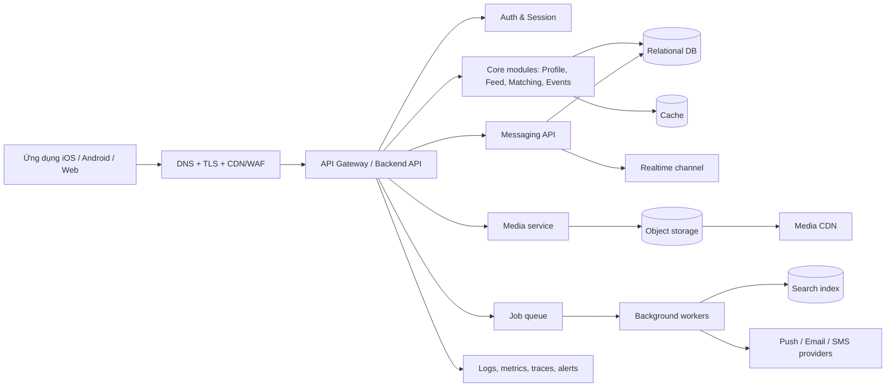

# Vivu — Đặc tả Cơ sở hạ tầng

**Phiên bản:** 1.0 · **Trạng thái:** Kiến trúc tham khảo, chưa gắn với nhà cung cấp cụ thể

> Tài liệu này mô tả hạ tầng mục tiêu cho MVP và tiêu chí lựa chọn. Chưa có thông tin trong repo để xác nhận stack, cloud, quy mô tải hoặc vùng lưu trữ hiện tại; vì vậy đây là đề xuất trung lập theo nhà cung cấp, không phải bản kê khai hệ thống đã triển khai.

## 1. Mục tiêu kiến trúc

- Phục vụ ứng dụng Vivu trên mobile/web qua API có phiên bản.
- Bảo vệ dữ liệu tài khoản, hồ sơ, vị trí gần đúng, tin nhắn và báo cáo.
- Hỗ trợ feed, search, matching, kèo, chat realtime, media và thông báo.
- Có quan sát vận hành, sao lưu và phục hồi phù hợp với MVP.
- Cho phép tăng tải theo thành phần mà không buộc viết lại toàn bộ hệ thống.

## 2. Nguyên tắc và giả định

- Bắt đầu bằng **modular monolith** hoặc một backend có ranh giới module rõ; tách dịch vụ chỉ khi tải/đội ngũ yêu cầu.
- Dùng API stateless; tác vụ nền chạy qua hàng đợi.
- Dữ liệu giao dịch cốt lõi nằm trong cơ sở dữ liệu quan hệ.
- Media lưu trong object storage, phân phối qua CDN.
- Mọi quyền truy cập dữ liệu được kiểm tra phía server.
- Không lưu vị trí chính xác lâu hơn mức cần thiết cho một hành động được người dùng cho phép.
- Chưa chốt cloud, framework, DB engine, nhà cung cấp push/SMS/email hoặc yêu cầu residency.

## 3. Sơ đồ thành phần

## 4. Các lớp hạ tầng

### 4.1 Client và edge

- Client lưu token qua secure storage của nền tảng; không lưu bí mật trong local storage không an toàn.
- DNS, TLS, CDN và WAF bảo vệ lưu lượng công khai, cache nội dung tĩnh/media công khai.
- CDN không cache response riêng tư hoặc dữ liệu cá nhân nếu chưa có cache key và quyền truy cập được thiết kế an toàn.
- Giới hạn kích thước request, timeout và rate limit tại edge/API.

### 4.2 Backend/API

- API có prefix phiên bản, ví dụ `/v1`, schema được mô tả bằng OpenAPI.
- Các module tối thiểu: Auth, User/Profile, Social graph, Feed, Search, Event/Matching, Membership/Requests, Messaging, Notifications, Media, Safety/Moderation.
- Kiểm tra input, phân quyền theo đối tượng và chống truy cập IDOR ở server.
- Tác vụ dài hoặc có retry (gửi thông báo, xử lý media, lập chỉ mục search) chạy nền.
- Dùng idempotency key cho các thao tác tạo yêu cầu/kèo và xử lý thanh toán tương lai nếu có.

### 4.3 Dữ liệu

| Kho dữ liệu | Mục đích | Đề xuất |
|---|---|---|
| CSDL quan hệ | Người dùng, hồ sơ, kèo, yêu cầu, thành viên, quyền, trạng thái | Chọn một DB quan hệ được dịch vụ cloud quản lý; bật mã hóa và sao lưu |
| Cache | Session lookup, rate limit, dữ liệu nóng, presence ngắn hạn | Không làm nguồn dữ liệu chuẩn; TTL rõ ràng |
| Object storage | Ảnh/video và tệp đính kèm | Bucket riêng tư mặc định, URL ký hạn ngắn, kiểm tra loại/kích thước |
| Search index | Từ khóa người/kèo/địa điểm/bài viết được phép tìm | Đồng bộ bất đồng bộ; xóa/ẩn phải lan truyền tới index |
| Analytics warehouse | Sự kiện sản phẩm đã giảm định danh | Tách khỏi DB giao dịch; giới hạn quyền và thời hạn lưu |

### 4.4 Realtime và thông báo

- Realtime dùng WebSocket hoặc dịch vụ managed; kênh được xác thực và phân quyền theo hội thoại.
- Push là kênh bổ sung; trạng thái tin phải được lưu bền vững để client đồng bộ lại sau offline.
- Email/SMS/Push gửi qua worker; retry có backoff, giới hạn và dead-letter queue.
- Payload push không chứa nội dung nhạy cảm mặc định; tuân thủ thiết lập xem trước của người dùng.

## 5. Mô hình module và quyền dữ liệu

| Module | Sở hữu dữ liệu | Quy tắc truy cập |
|---|---|---|
| Auth | Tài khoản định danh, phiên, thông tin xác minh | Không trả mật khẩu/token qua API; quản lý phiên và thu hồi |
| Profile | Hồ sơ và sở thích | Trường công khai theo cài đặt; private-by-default cho dữ liệu nhạy cảm |
| Feed | Bài đăng, media reference, tương tác | Mỗi truy vấn áp dụng audience, block và moderation state |
| Matching/Events | Kèo, yêu cầu, thành viên, địa điểm gần đúng | Chủ kèo/thành viên có quyền theo trạng thái; không tin client về số chỗ |
| Messaging | Hội thoại, thành viên, tin nhắn, read cursor | Thành viên hợp lệ mới đọc/gửi; quyền kiểm tra từng conversation |
| Search | Tài liệu chỉ mục | Chỉ lập chỉ mục trường được phép; đồng bộ xóa và thay quyền |
| Safety | Báo cáo, block, quyết định moderation | Quyền hạn chế; audit log không chứa bí mật không cần thiết |

## 6. Bảo mật

- TLS mọi kết nối; mã hóa dữ liệu lưu trữ và backup theo khả năng nhà cung cấp.
- Secrets nằm trong secret manager, xoay vòng định kỳ; không commit vào repo hoặc image.
- RBAC tối thiểu cần thiết cho vận hành; MFA cho console/cloud admin.
- Phân tách môi trường dev, staging, production và tài khoản/quyền riêng.
- Rate limit cho đăng nhập, OTP, tìm kiếm, tạo kèo, gửi tin và báo cáo.
- Upload media qua URL ký hạn ngắn; kiểm tra MIME thực, kích thước, antivirus/moderation theo yêu cầu.
- Audit các hành động quản trị và truy cập dữ liệu nhạy cảm.
- Không ghi password, OTP, access token, session cookie, nội dung tin riêng hoặc tọa độ chính xác vào log.
- Bảo vệ chống XSS, CSRF, SSRF, SQL injection, IDOR và replay dựa trên bề mặt thực tế.
- Quy trình phát hiện lỗ hổng và ứng phó sự cố cần người chịu trách nhiệm và thời gian xử lý được chốt.

## 7. Quyền riêng tư và vòng đời dữ liệu

- Chỉ thu vị trí khi tính năng cần; hỗ trợ khu vực nhập tay.
- Lưu vị trí gần đúng phục vụ khám phá; hạn chế giữ tọa độ chính xác và đặt TTL nếu xử lý tạm.
- Cho người dùng tải/xóa dữ liệu theo chính sách áp dụng.
- Xác định thời hạn lưu cho tin nhắn, media, báo cáo, log và dữ liệu analytics.
- Khi tài khoản bị xóa, có quy trình xóa hoặc khử định danh dữ liệu liên kết, trừ phần phải lưu vì nghĩa vụ pháp lý/an toàn.
- Xác định khu vực lưu trữ và xử lý dữ liệu trước khi chọn nhà cung cấp cloud.

## 8. Tin cậy, sao lưu và phục hồi

- Sao lưu tự động DB; mã hóa backup và kiểm thử khôi phục định kỳ.
- Xác định RPO (mức mất dữ liệu chấp nhận được) và RTO (thời gian phục hồi chấp nhận được) theo mức độ sản phẩm; MVP cần chốt trước khi production.
- Có runbook cho DB mất kết nối, queue tắc, provider outage, lộ credential và sai cấu hình quyền.
- Hàng đợi cần retry có giới hạn, exponential backoff, dead-letter queue và dashboard tuổi message.
- Xóa dữ liệu có thể phục hồi bằng soft delete khi phù hợp; việc xóa vĩnh viễn cần audit và theo chính sách.

## 9. Quan sát vận hành

### Logs

- Structured logs có request ID/trace ID, module, mức độ và mã lỗi.
- Redact PII và secrets trước khi ghi; giới hạn truy cập, thời hạn lưu và xuất log.

### Metrics

- API latency p50/p95/p99, error rate, throughput.
- DB connection/slow queries, cache hit rate, queue lag/dead letters.
- Realtime connection, message delivery lag, push provider failures.
- Upload failure, CDN errors, storage growth.
- Business metrics như đăng kèo, yêu cầu tham gia và cuộc hẹn chốt ở analytics đã giảm định danh.

### Alerts

- Báo lỗi API tăng, độ trễ vượt SLO, DB/queue gần giới hạn, backup thất bại, provider thông báo lỗi hoặc tín hiệu đăng nhập bất thường.
- Mỗi alert có owner, mức độ và runbook; tránh cảnh báo không có hành động.

## 10. Môi trường và phát hành

- Môi trường riêng: local/dev, staging, production; dữ liệu production không sao chép nguyên trạng về dev.
- CI chạy lint, unit/integration tests, dependency/security scanning và migration check.
- CD triển khai artifact bất biến; migration tương thích ngược và có kế hoạch rollback.
- Dùng feature flags cho phát hành Matching, realtime và thay đổi có rủi ro.
- Canary hoặc rollout theo tỷ lệ khi nền tảng hỗ trợ; theo dõi metrics sau triển khai.
- Infrastructure as Code được review, lưu phiên bản và không chứa secret plaintext.

## 11. Mở rộng và hiệu năng

- API stateless có thể scale ngang sau load balancer.
- Phân trang cursor cho feed/search/message history; giới hạn kích thước trang.
- Index DB theo truy vấn thực tế: kèo theo trạng thái/thời gian/khu vực, membership theo user/event, conversation theo updated_at.
- Không tính matching toàn bộ dữ liệu đồng bộ trong request; dùng truy vấn chỉ mục/candidate set và cache có TTL.
- Media lớn đi thẳng tới object storage qua signed upload, không proxy qua API app.
- Chỉ tách service khi cần scale/deploy độc lập, ownership đội ngũ rõ và có đo đạc chứng minh.

## 12. Kế hoạch triển khai hạ tầng theo giai đoạn

| Giai đoạn | Hạng mục |
|---|---|
| MVP nội bộ | Một backend modular, managed relational DB, object storage, auth, logging, backup, staging và CI/CD |
| Beta | Queue/worker, search index, realtime managed hoặc WebSocket, push, rate limits, dashboards/alerts |
| Production mở rộng | WAF, multi-zone HA, DR theo RPO/RTO, audit nâng cao, load testing, incident on-call và cost controls |

## 13. Tiêu chí sẵn sàng production

- [ ] Chọn cloud/region và xác nhận yêu cầu lưu trú dữ liệu.
- [ ] Có threat model, phân loại dữ liệu và chính sách retention.
- [ ] Auth, RBAC, rate limit, secret management và MFA quản trị đã bật.
- [ ] Backup tự động đã cấu hình và khôi phục thử thành công.
- [ ] Monitoring, alert và runbook có người phụ trách.
- [ ] Migration và rollback được diễn tập ở staging.
- [ ] API/DB/storage/realtime/queue có giới hạn và cảnh báo dung lượng.
- [ ] Kiểm thử tải theo mục tiêu MAU/DAU, concurrent chat và media throughput đã thống nhất.
- [ ] Quy trình xử lý báo cáo an toàn và sự cố bảo mật đã được phê duyệt.
- [ ] Ngân sách và cảnh báo chi phí cloud đã thiết lập.

## 14. Quyết định còn mở

| Quyết định | Cần thông tin gì |
|---|---|
| Cloud và vùng triển khai | Thị trường, latency, ngân sách, quy định lưu trú dữ liệu |
| Ngôn ngữ/framework backend | Kỹ năng đội ngũ, repo hiện tại, tuyển dụng/vận hành |
| CSDL và search | Quy mô dữ liệu, truy vấn địa lý, khả năng vận hành |
| Chat realtime | Mức tải đồng thời, nhu cầu read receipts, chi phí managed service |
| SLO, RPO, RTO | Mức quan trọng dịch vụ và ngân sách dự phòng |
| Xác minh tài khoản | Yêu cầu an toàn, pháp lý và dữ liệu cần thu |
| Retention và xóa tài khoản | Nghĩa vụ pháp lý, chống lạm dụng và trải nghiệm người dùng |

## 15. Phụ thuộc

Tài liệu này cần được đối chiếu với repo backend/client, yêu cầu pháp lý theo thị trường mục tiêu, dự báo tải, ngân sách, chính sách bảo mật và quy trình vận hành trước khi trở thành kiến trúc triển khai cuối cùng.
