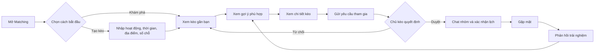

ĐẶC TẢ SẢN PHẨM  /  01

# Vivu Matching

Đặc tả chức năng ghép người cùng kế hoạch đi chơi

Tài liệu mô tả cách người dùng khám phá hoặc tạo một kèo, tìm người phù hợp, xin tham gia và chốt cuộc hẹn ngoài đời. Matching được tổ chức quanh ý định đi chơi cụ thể — hoạt động, thời gian và địa điểm — để người dùng có thể chuyển từ ý định sang kế hoạch thực tế trong một luồng rõ ràng.

### Thông tin tài liệu

| Thuộc tính | Giá trị |
| --- | --- |
| Sản phẩm | Vivu |
| Phạm vi | Matching theo kèo đi chơi; trải nghiệm mobile-first |
| Phiên bản | 1.0 · Đề xuất để rà soát sản phẩm |
| Đối tượng đọc | Product, UX/UI, Engineering, QA, Operations |
| Trạng thái | Bản đặc tả khởi đầu; các giả định cần xác nhận được nêu trong tài liệu |

### Định nghĩa sản phẩm

Vivu giúp người dùng tìm người cùng muốn làm một hoạt động cụ thể, ở gần nhau và vào thời điểm tương thích. Đơn vị matching chính là “kèo” — lời mời có hoạt động, thời gian, địa điểm, số chỗ và chủ kèo — thay vì một hồ sơ cá nhân trừu tượng.

Nguyên tắc trải nghiệm: người dùng nhìn thấy vì sao kèo phù hợp, biết rõ ai tổ chức và gặp ở đâu, rồi chỉ cần một hành động chính để xin tham gia. Chủ kèo kiểm soát danh sách thành viên trước khi nhóm chat được mở.

## 1. Mục tiêu và phạm vi

### 1.1 Mục tiêu

- Giảm thời gian từ lúc muốn đi chơi đến lúc tìm được người đồng hành.

- Tập trung matching vào ý định có thể hành động: hoạt động + giờ + khu vực.

- Giúp người dùng đánh giá nhanh độ phù hợp và mức độ tin cậy trước khi gửi yêu cầu.

- Tạo một vòng lặp sử dụng: tham gia kèo → trải nghiệm → nhận gợi ý phù hợp lần sau.

### 1.2 Ngoài phạm vi bản đầu

- Hẹn hò lãng mạn hoặc chấm điểm mức độ hấp dẫn hồ sơ.

- Thanh toán, đặt chỗ, mua vé hoặc giao dịch giữa người dùng.

- Điều phối phương tiện, định vị trực tiếp liên tục hoặc theo dõi người tham gia.

- Thuật toán học máy phức tạp; bản đầu dùng bộ lọc và điểm xếp hạng giải thích được.

### 1.3 Người dùng và nhu cầu

| Nhóm | Nhu cầu chính | Thành công khi |
| --- | --- | --- |
| Người tìm kèo | Có kế hoạch nhưng thiếu bạn đồng hành | Tham gia được một kèo phù hợp với ít thao tác |
| Chủ kèo | Muốn tìm thêm người phù hợp và kiểm soát nhóm | Duyệt đúng người, đủ số chỗ và chốt lịch |
| Người mới | Muốn thử hoạt động cùng người lạ trong môi trường rõ ràng | Biết ai tham gia, nơi gặp và cách rời/báo cáo |

## 2. Kiến trúc chức năng

| Khu vực | Chức năng | Kết quả |
| --- | --- | --- |
| Khám phá | Danh sách kèo, bộ lọc, bản đồ/khoảng cách | Người dùng tìm được kèo đang mở |
| Tạo kèo | Nhập hoạt động, lịch, địa điểm, chỗ và mô tả | Kèo được đăng và nhận yêu cầu |
| Matching | Xếp hạng theo thời gian, khoảng cách, sở thích và trạng thái | Gợi ý liên quan, có lý do phù hợp |
| Tham gia | Chi tiết kèo, gửi yêu cầu, quyết định của chủ kèo | Thành viên được xác nhận hoặc nhận kết quả từ chối |
| Điều phối | Chat nhóm, cập nhật lịch, chỉ đường, hủy kèo | Nhóm biết kế hoạch mới nhất |
| Tin cậy & an toàn | Báo cáo, chặn, quyền riêng tư, hỗ trợ | Người dùng kiểm soát tương tác và rủi ro |

### Luồng chính

Mở Matching → khám phá kèo hoặc tạo kèo → chọn kế hoạch → xem gợi ý phù hợp → mở chi tiết → gửi yêu cầu tham gia → chủ kèo duyệt → mở chat nhóm → xác nhận lịch và điểm gặp → trải nghiệm → phản hồi để cải thiện gợi ý.

### Nhánh từ chối

Nếu chủ kèo từ chối, người yêu cầu nhận thông báo nhẹ nhàng và được quay lại danh sách kèo. Không hiển thị lý do cá nhân bắt buộc; chủ kèo có thể chọn lý do nhanh để giúp người dùng hiểu trạng thái mà không tạo áp lực.

## 3. Yêu cầu chức năng

Mức ưu tiên: P0 cần có để kiểm thử lời hứa cốt lõi; P1 giúp trải nghiệm hoàn chỉnh; P2 có thể phát triển sau khi xác nhận nhu cầu.

| ID | Chức năng | Yêu cầu / hành vi mong đợi | Ưu tiên |
| --- | --- | --- | --- |
| DISC-01 | Danh sách kèo | Hiển thị kèo đang mở, sắp diễn ra, còn chỗ và trong phạm vi tìm kiếm. Mỗi thẻ có hoạt động, giờ, khu vực/khoảng cách, số chỗ còn lại, chủ kèo và điểm phù hợp. | P0 |
| DISC-02 | Thứ tự gợi ý | Xếp theo mức phù hợp và thời gian diễn ra. Nêu tối đa 1–2 lý do dễ hiểu như “Cùng mê cà phê”, “Cùng khung giờ”. | P0 |
| DISC-03 | Bộ lọc | Lọc theo loại hoạt động, thời gian, bán kính, số chỗ và nhóm bạn bè/công khai. Bộ lọc đang bật phải nhìn thấy và có thể xóa. | P1 |
| DISC-04 | Bản đồ và danh sách | Có thể xem kèo trên bản đồ hoặc danh sách; vị trí chính xác của điểm gặp chỉ hiện theo thiết lập riêng của chủ kèo. | P1 |
| PLAN-01 | Tạo kèo | Bắt buộc: hoạt động, ngày/giờ, khu vực/địa điểm công khai, số người tối đa và quyền hiển thị. Mô tả và ảnh là tùy chọn. | P0 |
| PLAN-02 | Kiểm tra dữ liệu | Không cho đăng nếu thời gian ở quá khứ, số chỗ không hợp lệ hoặc địa điểm thiếu thông tin tối thiểu. Hiển thị lỗi ngay tại trường. | P0 |
| PLAN-03 | Sửa và hủy | Chủ kèo được sửa thông tin hoặc hủy; thành viên đã duyệt nhận thông báo khi thay đổi ngày, giờ, địa điểm, số chỗ hoặc hủy. | P0 |
| PLAN-04 | Đóng kèo | Kèo tự chuyển sang hết chỗ khi đủ số thành viên hoặc qua giờ hết hạn. Chủ kèo có thể đóng nhận yêu cầu thủ công. | P1 |
| JOIN-01 | Chi tiết kèo | Hiển thị đầy đủ nội dung, giờ, địa điểm, khoảng cách ước tính, chủ kèo, thành viên/đề nghị tham gia và quy tắc an toàn. | P0 |
| JOIN-02 | Xin tham gia | Người dùng đủ điều kiện gửi một yêu cầu; có thể đính kèm lời giới thiệu ngắn tùy chọn. Trạng thái ngay sau gửi là “Chờ duyệt”. | P0 |
| JOIN-03 | Duyệt yêu cầu | Chủ kèo chấp nhận hoặc từ chối. Khi chấp nhận, hệ thống kiểm tra lại số chỗ và trạng thái kèo để tránh vượt giới hạn. | P0 |
| JOIN-04 | Chống yêu cầu trùng | Không cho gửi nhiều yêu cầu đang chờ cho cùng một kèo; cho phép rút yêu cầu trước khi được duyệt. | P1 |
| CHAT-01 | Chat nhóm | Chỉ thành viên đã được chủ kèo duyệt mới được vào chat nhóm. Chat hiển thị thông tin lịch và địa điểm ghim ở đầu. | P0 |
| CHAT-02 | Cập nhật kế hoạch | Khi chủ kèo sửa lịch/địa điểm, thông báo hệ thống được ghim trong nhóm để mọi người xác nhận đã đọc. | P1 |
| TRUST-01 | Báo cáo và chặn | Có lối báo cáo từ hồ sơ, kèo và chat; người dùng có thể chặn tài khoản. Hiển thị xác nhận và trạng thái tiếp nhận. | P0 |
| TRUST-02 | Thông tin địa điểm | Ưu tiên điểm công cộng. Không bắt buộc nhập hoặc công khai địa chỉ nhà riêng; cung cấp cách chọn khu vực gần đúng. | P0 |
| FEED-01 | Lưu kèo | Người dùng lưu/bỏ lưu kèo và xem lại danh sách đã lưu; kèo đã đóng phải được đánh dấu trạng thái. | P2 |
| FEED-02 | Phản hồi sau trải nghiệm | Cho phép đánh dấu đã tham gia, bỏ lỡ hoặc hủy; có thể đánh giá mức độ hữu ích của gợi ý. Không ép chấm điểm con người. | P2 |

## 4. Luồng người dùng chi tiết

### 4.1 Người tìm kèo

| Bước | Màn hình / thao tác | Kết quả hệ thống |
| --- | --- | --- |
| 1 | Mở tab “Đi cùng” | Tải kèo đang mở theo vị trí/khu vực đã chọn; nếu chưa cấp vị trí thì dùng khu vực thủ công. |
| 2 | Chọn bộ lọc hoặc xem danh sách | Cập nhật kết quả; giữ bộ lọc khi mở rồi quay lại danh sách trong phiên. |
| 3 | Chọn một thẻ kèo | Mở chi tiết kèo và hiện chủ kèo, thành viên, giờ, nơi gặp, số chỗ. |
| 4 | Nhấn “Tham gia kèo” | Nếu chưa đăng nhập/hoàn tất hồ sơ, điều hướng sang bước cần thiết; nếu đủ điều kiện, tạo yêu cầu chờ duyệt. |
| 5 | Chờ quyết định | Thông báo khi được duyệt/từ chối/rút yêu cầu; không mở chat trước khi duyệt. |
| 6 | Sau khi duyệt | Mở chat nhóm; xác nhận giờ và điểm gặp; có thể xem chỉ đường. |

### 4.2 Chủ kèo

| Bước | Màn hình / thao tác | Kết quả hệ thống |
| --- | --- | --- |
| 1 | Nhấn “Tạo kèo” | Mở biểu mẫu ngắn, nêu rõ thông tin bắt buộc. |
| 2 | Chọn hoạt động, giờ, địa điểm, số chỗ | Hiển thị bản xem trước và quyền riêng tư. |
| 3 | Đăng kèo | Kiểm tra dữ liệu, tạo mã kèo, đưa vào danh sách phù hợp. |
| 4 | Nhận yêu cầu | Hiện danh sách ứng viên, hồ sơ cơ bản, lời nhắn (nếu có) và số chỗ còn. |
| 5 | Duyệt hoặc từ chối | Cập nhật trạng thái; khi duyệt gửi thông báo và thêm thành viên vào nhóm. |
| 6 | Chuẩn bị gặp | Quản lý kèo: xem thành viên, gửi cập nhật, đóng hoặc hủy kèo. |

## 5. Trạng thái và quy tắc nghiệp vụ

### 5.1 Trạng thái kèo

| Trạng thái | Ý nghĩa | Hành động được phép |
| --- | --- | --- |
| Bản nháp | Chưa công khai | Chủ kèo sửa, đăng hoặc xóa nháp |
| Đang mở | Đang nhận yêu cầu và còn chỗ | Xem, lưu, gửi yêu cầu; chủ kèo duyệt/sửa/đóng |
| Đủ chỗ | Đạt giới hạn thành viên | Không nhận thêm người; thành viên tiếp tục chat |
| Đã diễn ra | Đã qua thời điểm hoạt động | Xem lịch sử, phản hồi; không gửi yêu cầu |
| Đã hủy | Chủ kèo hủy hoặc hệ thống đóng theo quy tắc | Xem lý do/thông báo; không tham gia |
| Hết hạn | Không còn hiệu lực theo thời gian nhận người | Xem trạng thái; không gửi yêu cầu |

### 5.2 Trạng thái yêu cầu tham gia

Chờ duyệt → Đã chấp nhận hoặc Bị từ chối. Người gửi có thể rút khi còn chờ duyệt. Khi kèo bị hủy/đóng hoặc không còn chỗ, yêu cầu chờ được tự đóng và người gửi được thông báo. Hệ thống phải xử lý thao tác duyệt đồng thời theo cách chỉ xác nhận tối đa số thành viên cho phép.

### 5.3 Quy tắc matching đề xuất cho MVP

| Tín hiệu | Xử lý đề xuất | Lý do hiển thị |
| --- | --- | --- |
| Thời gian | Ưu tiên kèo tương thích với khung giờ rảnh hoặc thời gian người dùng chọn | “Cùng khung giờ bạn đã chọn” |
| Khoảng cách | Ưu tiên gần hơn trong bán kính do người dùng đặt; không cần lộ tọa độ chính xác | “Gần khu vực bạn chọn” |
| Sở thích | Tăng điểm khi hoạt động khớp sở thích khai báo hoặc hành vi lưu/tìm kiếm | “Cùng mê cà phê” |
| Còn chỗ / trạng thái | Ẩn hoặc hạ kèo đã đóng, đủ chỗ, đã hủy, hết hạn | “Còn 2 chỗ” |
| Mức mới | Dùng thời gian đăng như yếu tố phụ, tránh kèo cũ chiếm đầu danh sách | “Mới đăng” |

Không dùng giới tính, độ tuổi nhạy cảm, ngoại hình hoặc thuộc tính nhạy cảm làm lý do xếp hạng mặc định. Nếu bổ sung tùy chọn giới hạn thành viên theo tiêu chí cá nhân, cần rà soát chính sách, công bằng và yêu cầu pháp lý trước khi triển khai.

## 6. Dữ liệu và quyền riêng tư

| Đối tượng dữ liệu | Trường chính | Ghi chú |
| --- | --- | --- |
| Kèo | ID, chủ kèo, loại hoạt động, mô tả, giờ bắt đầu/kết thúc, khu vực/địa điểm, số người tối đa, quyền riêng tư, trạng thái | Lưu giờ theo múi giờ chuẩn; hiển thị theo múi giờ thiết bị. |
| Yêu cầu tham gia | ID kèo, người gửi, lời nhắn, thời gian gửi, trạng thái, thời gian quyết định | Giới hạn một yêu cầu đang chờ trên mỗi người/kèo. |
| Thành viên | ID kèo, người dùng, vai trò, trạng thái tham gia, thời điểm xác nhận | Chỉ chủ kèo/thành viên được xem danh sách tùy thiết lập. |
| Sở thích matching | Loại hoạt động, khung giờ, khu vực/bán kính, lịch sử tương tác tối thiểu | Cho người dùng xem, chỉnh sửa và xóa tùy chọn. |
| Báo cáo an toàn | Người báo cáo, đối tượng, loại vấn đề, thời gian, trạng thái xử lý | Hạn chế quyền truy cập theo vai trò vận hành. |

- Xin quyền vị trí đúng lúc cần; nếu người dùng từ chối, cho nhập khu vực bằng tay.

- Trên thẻ và bản đồ chỉ hiển thị khoảng cách/khu vực gần đúng, không hiển thị vị trí nhà riêng.

- Cho phép xóa yêu cầu, rời kèo, chặn người dùng và báo cáo mà không phải tìm sâu trong menu.

- Quy định thời hạn lưu dữ liệu vị trí và báo cáo cần được xác nhận cùng chính sách quyền riêng tư của sản phẩm.

## 7. Thông báo

| Sự kiện | Người nhận | Nội dung / hành động |
| --- | --- | --- |
| Có yêu cầu mới | Chủ kèo | Tên người gửi, tên kèo, nút mở danh sách yêu cầu |
| Yêu cầu được duyệt | Người gửi | Kèo đã chấp nhận; mở chat nhóm |
| Yêu cầu bị từ chối | Người gửi | Kết quả ngắn gọn; quay lại khám phá kèo |
| Kèo sắp diễn ra | Thành viên đã duyệt | Nhắc thời gian và khu vực theo cài đặt thông báo |
| Thay đổi giờ/địa điểm | Tất cả thành viên đã duyệt | Tóm tắt giá trị cũ/mới; mở chi tiết để xác nhận |
| Kèo bị hủy/đóng | Người gửi chờ và thành viên | Thông báo trạng thái; giải thích bước tiếp theo |

Người dùng có thể tắt nhắc nhở không thiết yếu. Thông báo về trạng thái yêu cầu, hủy kèo và thay đổi địa điểm cần được ưu tiên vì ảnh hưởng trực tiếp đến cuộc hẹn.

## 8. Trạng thái giao diện và xử lý ngoại lệ

| Tình huống | Cách xử lý giao diện |
| --- | --- |
| Chưa có kèo phù hợp | Nêu rõ bộ lọc đang áp dụng; đề xuất mở rộng thời gian/khu vực hoặc tạo kèo. |
| Chưa cấp vị trí | Cho nhập khu vực hoặc tiếp tục với gợi ý phổ biến; không khóa luồng. |
| Mất kết nối khi gửi yêu cầu | Giữ nội dung nhập, báo chưa gửi và cho thử lại; chống tạo yêu cầu trùng khi retry. |
| Kèo vừa đủ chỗ | Cập nhật trạng thái ngay; báo kèo vừa đủ chỗ và gợi ý kèo tương tự. |
| Chủ kèo chưa quyết định | Hiện thời điểm gửi và trạng thái chờ; cung cấp rút yêu cầu. |
| Chủ kèo đổi kế hoạch | Hiện thông tin mới và yêu cầu xác nhận nếu thay đổi trọng yếu. |
| Kèo bị báo cáo/ẩn | Không lộ danh tính người báo cáo; ẩn nội dung tùy mức độ và chính sách xử lý. |

## 9. Tiêu chí nghiệm thu MVP

- Người dùng xem được danh sách kèo đang mở và biết hoạt động, thời gian, khu vực, chỗ còn lại.

- Người dùng tạo được kèo hợp lệ; lỗi dữ liệu hiển thị tại đúng trường.

- Người dùng có thể gửi một yêu cầu đang chờ cho một kèo và rút yêu cầu đó.

- Chủ kèo chấp nhận/từ chối yêu cầu; hệ thống không cho vượt số chỗ khi có thao tác đồng thời.

- Chỉ thành viên được duyệt mới truy cập chat nhóm.

- Thay đổi hoặc hủy kế hoạch gửi thông báo cho người bị ảnh hưởng.

- Người dùng có thể khám phá bằng khu vực nhập tay nếu không cấp quyền vị trí.

- Có đường dẫn báo cáo/chặn từ hồ sơ hoặc kèo; thao tác hoàn thành có xác nhận rõ ràng.

- Kèo đủ chỗ, đã hủy, đã diễn ra hoặc hết hạn không nhận yêu cầu mới.

## 10. Chỉ số đánh giá

| Chỉ số | Định nghĩa đề xuất | Cách đọc |
| --- | --- | --- |
| Tỷ lệ tạo kèo thành công | Kèo đăng thành công / lượt bắt đầu tạo kèo | Phát hiện biểu mẫu quá dài hoặc lỗi nhập liệu |
| Tỷ lệ yêu cầu được chấp nhận | Yêu cầu được duyệt / yêu cầu đã có quyết định | Đánh giá độ phù hợp và chất lượng kèo |
| Thời gian đến lần kết nối đầu | Thời gian từ đăng kèo đến lần đầu có người được duyệt | Kiểm tra nguồn cung kèo và tính thanh khoản |
| Tỷ lệ cuộc hẹn xác nhận | Kèo có thành viên xác nhận lịch / kèo có ít nhất một người được duyệt | Đo khả năng chuyển matching thành kế hoạch |
| Tỷ lệ hủy hoặc vắng mặt | Kèo hủy hoặc thành viên không xác nhận/không đến trên số kèo đã chốt | Theo dõi độ tin cậy; cần định nghĩa đo lường phù hợp |
| Tỷ lệ báo cáo an toàn | Báo cáo trên số lượt tham gia/kết nối | Theo dõi an toàn, cần đọc cùng mức độ và kết quả xử lý |

Không tối ưu riêng số yêu cầu gửi. Chỉ số tăng trưởng cần được đọc cùng tỷ lệ được duyệt, tỷ lệ kế hoạch diễn ra và tín hiệu an toàn.

## 11. Phân kỳ triển khai

| Giai đoạn | Nội dung | Điều kiện chuyển giai đoạn |
| --- | --- | --- |
| MVP | Tạo kèo, danh sách, chi tiết, yêu cầu tham gia, duyệt/từ chối, chat nhóm, hủy kèo, báo cáo cơ bản | Kiểm tra được luồng từ đăng kèo đến có thành viên được duyệt |
| Hoàn thiện | Bộ lọc, bản đồ, lưu kèo, nhắc lịch, cập nhật thay đổi trong nhóm | Có đủ dữ liệu để thấy bộ lọc và nhắc lịch cải thiện trải nghiệm |
| Tối ưu | Xếp hạng cá nhân hóa, gợi ý mở rộng kèo, phản hồi sau trải nghiệm | Định nghĩa rõ dữ liệu, quyền riêng tư và đo lường trước khi cá nhân hóa |

## 12. Giả định cần chốt với nhóm sản phẩm

| Câu hỏi quyết định | Đề xuất ban đầu |
| --- | --- |
| Kèo là riêng tư hay công khai? | Mặc định kèo công khai trong khu vực; cho chủ kèo đổi đối tượng được xem. |
| Có cần duyệt từng người? | Có trong MVP để chủ kèo kiểm soát thành viên; có thể cho phép tham gia tự động ở loại kèo rủi ro thấp sau này. |
| Bán kính tìm kiếm mặc định? | Cho người dùng chọn nhanh theo khu vực; tránh tự bật định vị chính xác. |
| Ai có thể tạo/tham gia kèo? | Tài khoản đủ điều kiện cơ bản; yêu cầu xác minh bổ sung cần quyết định theo nghiên cứu và chính sách an toàn. |
| Quy mô nhóm tối đa? | Để chủ kèo chọn trong giới hạn sản phẩm; thiết kế MVP tối ưu cho nhóm nhỏ. |
| Xử lý hành vi nguy hiểm? | Cần quy trình vận hành, mức độ vi phạm, thời gian phản hồi và cơ chế kháng nghị được định nghĩa trước khi mở rộng. |

## Phụ lục A · Danh sách màn hình

| Mã màn hình | Màn hình | Nội dung chính |
| --- | --- | --- |
| M-01 | Matching / Khám phá | Lời hứa sản phẩm, kèo gần bạn, bộ lọc, nút tạo kèo |
| M-02 | Danh sách kết quả | Danh sách kèo theo bộ lọc và trạng thái |
| M-03 | Bản đồ kèo | Ghim khu vực, thẻ kèo đã chọn, chuyển danh sách |
| M-04 | Chi tiết kèo | Thông tin kèo, chủ kèo, thành viên, an toàn, CTA tham gia |
| M-05 | Tạo kèo | Biểu mẫu hoạt động, thời gian, địa điểm, số chỗ, riêng tư |
| M-06 | Yêu cầu tham gia | Danh sách chờ và hành động duyệt/từ chối |
| M-07 | Quản lý kèo | Trạng thái, thành viên, sửa/hủy, mở chat nhóm |
| M-08 | Chat nhóm | Thành viên đã duyệt, kế hoạch ghim, xác nhận lịch |
| M-09 | Yêu cầu của tôi | Chờ duyệt, đã duyệt, từ chối, đã rút |
| M-10 | Báo cáo / chặn | Chọn vấn đề, gửi báo cáo, chặn và xác nhận |

## Phụ lục B · Thuật ngữ

| Thuật ngữ | Định nghĩa |
| --- | --- |
| Kèo | Lời mời tham gia một hoạt động cụ thể, có thời gian và địa điểm/khu vực. |
| Chủ kèo | Người tạo kế hoạch, chịu trách nhiệm quản lý yêu cầu và cập nhật thông tin. |
| Yêu cầu tham gia | Đề nghị của người dùng để trở thành thành viên; cần được chủ kèo quyết định trong MVP. |
| Matching | Quá trình lọc và sắp xếp kèo theo tính liên quan với kế hoạch/ngữ cảnh của người dùng. |
| Cuộc hẹn đã chốt | Kế hoạch có ít nhất một thành viên được duyệt và thông tin giờ/điểm gặp đã được chia sẻ. |
