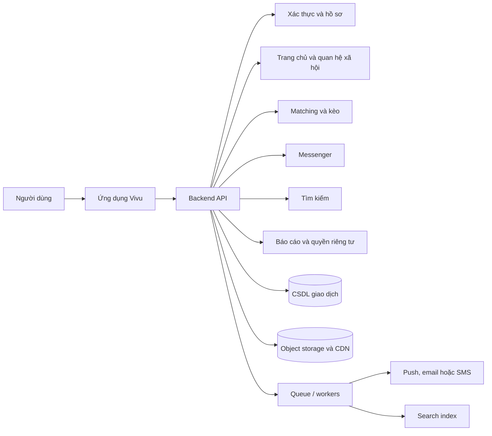
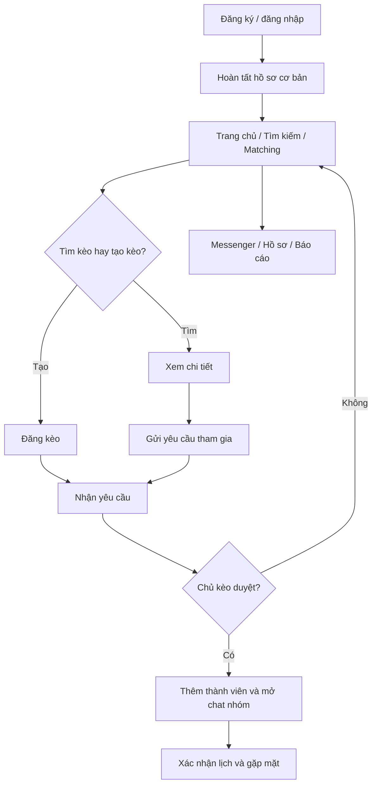

# Software Requirements Specification — Vivu

**Mã tài liệu:** VIVU-SRS-001  
**Phiên bản:** 1.0  
**Trạng thái:** Bản đề xuất để rà soát  
**Ngày cập nhật:** 2026-09-29  
**Đối tượng:** Product, UX/UI, Engineering, QA, Security và Operations

> Tài liệu này mô tả yêu cầu hệ thống cho Vivu dựa trên các đặc tả tính năng hiện có. Những quyết định chưa được xác nhận được đánh dấu **Cần chốt**. Các con số về tải, hiệu năng, lưu trữ và mức độ sẵn sàng không được xem là cam kết cho tới khi nhóm sản phẩm và kỹ thuật phê duyệt.

## 1. Giới thiệu

### 1.1 Mục đích

SRS xác định phạm vi, hành vi, giao diện, yêu cầu chất lượng và điều kiện nghiệm thu của Vivu. Tài liệu là cơ sở để thiết kế, phát triển, kiểm thử và đánh giá thay đổi yêu cầu.

### 1.2 Phạm vi sản phẩm

Vivu là ứng dụng cộng đồng giúp người dùng chia sẻ nội dung, khám phá địa điểm và tìm người cùng tham gia một hoạt động cụ thể. Khác biệt cốt lõi là matching theo **kèo đi chơi** có hoạt động, thời gian, địa điểm/khu vực và số chỗ, thay vì chỉ ghép hồ sơ.

Phạm vi SRS gồm:

- Tài khoản, đăng ký, đăng nhập và hồ sơ.
- Trang chủ, bài viết, story và tương tác.
- Tìm kiếm người, bài viết, địa điểm và kèo.
- Matching, tạo kèo, yêu cầu tham gia và điều phối kèo.
- Messenger một-một và chat nhóm kèo.
- Thông báo, quyền riêng tư, báo cáo và chặn.
- Hạ tầng logic, tích hợp ngoài và yêu cầu vận hành ở mức sản phẩm.

### 1.3 Thuật ngữ

| Thuật ngữ | Định nghĩa |
|---|---|
| Kèo | Lời mời tham gia hoạt động có thời gian và địa điểm/khu vực |
| Chủ kèo | Người tạo kèo và quản lý yêu cầu tham gia |
| Người tham gia | Người đã được chủ kèo chấp nhận vào kèo |
| Matching | Lọc và xếp hạng kèo theo mức phù hợp với ngữ cảnh người dùng |
| Khu vực gần đúng | Vị trí được làm tròn/khái quát để khám phá mà không lộ tọa độ chính xác |
| MVP | Phiên bản tối thiểu dùng để kiểm chứng lời hứa cốt lõi của sản phẩm |
| P0/P1/P2 | Bắt buộc cho MVP / nên có sau MVP / có thể phát triển sau |

### 1.4 Tài liệu liên quan

- `VIVU_MATCHING_FUNCTIONAL_SPEC.md`
- `HOME_FUNCTIONAL_SPEC.md`
- `MESSENGER_FUNCTIONAL_SPEC.md`
- `PROFILE_FUNCTIONAL_SPEC.md`
- `SEARCH_FUNCTIONAL_SPEC.md`
- `AUTH_FUNCTIONAL_SPEC.md`
- `INFRASTRUCTURE_SPEC.md`

## 2. Mô tả tổng thể

### 2.1 Bối cảnh hệ thống

Vivu gồm ứng dụng người dùng và backend cung cấp xác thực, hồ sơ, nguồn cấp, tìm kiếm, Matching/kèo, hội thoại, media, thông báo và an toàn. Ứng dụng có thể phát hành trên web và/hoặc thiết bị di động; nền tảng phát hành đầu tiên **cần chốt**.

### 2.2 Nhóm người dùng

| Nhóm | Mô tả | Quyền/nhu cầu chính |
|---|---|---|
| Khách chưa đăng nhập | Người mới khám phá Vivu | Xem nội dung/kèo công khai theo chính sách; cần đăng nhập để tạo hoặc tham gia |
| Thành viên | Người có tài khoản | Tạo hồ sơ, đăng nội dung, kết nối, tìm kiếm và tham gia kèo |
| Chủ kèo | Thành viên đã tạo kèo | Quản lý kèo, duyệt/từ chối yêu cầu, cập nhật/hủy kế hoạch |
| Quản trị/vận hành | Nhân sự được cấp quyền | Xử lý báo cáo, hỗ trợ tài khoản và vận hành hệ thống theo RBAC |

### 2.3 Giả định và phụ thuộc

- Backend là nguồn sự thật cho quyền truy cập, trạng thái kèo, thành viên và tin nhắn.
- Vị trí là tùy chọn; người dùng có thể nhập khu vực thủ công.
- Email/SMS, push, bản đồ/geocoding, lưu media và xác minh có thể cần nhà cung cấp ngoài; nhà cung cấp cụ thể **cần chốt**.
- Thị trường phát hành, yêu cầu độ tuổi và chính sách lưu trú dữ liệu **cần chốt**.
- Hệ thống cần có quy trình vận hành báo cáo an toàn trước khi mở rộng cho công chúng.

## 3. Yêu cầu giao diện bên ngoài

### 3.1 Giao diện người dùng

Ứng dụng cần cung cấp tối thiểu các màn hình sau:

| Mã | Màn hình | Nội dung/điều hướng |
|---|---|---|
| UI-01 | Đăng ký/đăng nhập | Đăng nhập, tạo tài khoản, xác minh, khôi phục mật khẩu |
| UI-02 | Trang chủ | Nguồn cấp, story, tương tác và lối vào kèo |
| UI-03 | Matching | Kèo gần bạn, bộ lọc, gợi ý phù hợp, tạo kèo |
| UI-04 | Danh sách/bản đồ kèo | Hiển thị kết quả và khu vực gần đúng |
| UI-05 | Chi tiết kèo | Nội dung, chủ kèo, thành viên, chỗ còn lại, CTA tham gia |
| UI-06 | Tạo/sửa kèo | Hoạt động, lịch, địa điểm, số chỗ, quyền riêng tư |
| UI-07 | Yêu cầu tham gia/quản lý | Danh sách chờ, duyệt/từ chối, đóng/hủy kèo |
| UI-08 | Messenger | Danh sách hội thoại, chat riêng và chat nhóm kèo |
| UI-09 | Profile | Hồ sơ công khai, sửa hồ sơ, nội dung, cài đặt riêng tư |
| UI-10 | Search | Gợi ý, lịch sử, tab Người/Bài viết/Địa điểm/Kèo |
| UI-11 | Thông báo | Thông báo kết nối, kèo, yêu cầu và tin nhắn |
| UI-12 | Báo cáo/chặn | Báo cáo nội dung/người dùng và quản lý chặn |

Các màn hình phải có trạng thái tải, rỗng, lỗi, hoàn tất và trạng thái không có quyền phù hợp. Giao diện phải hỗ trợ kích thước màn hình mục tiêu được nhóm thiết kế xác nhận.

### 3.2 Giao diện phần mềm

- Client gọi backend qua API có phiên bản và giao thức mã hóa.
- API nội bộ được mô tả bằng OpenAPI hoặc tài liệu tương đương.
- Realtime dùng kênh có xác thực và phân quyền theo người dùng/hội thoại.
- Tích hợp ngoài có thể gồm push, email/SMS, bản đồ/geocoding, CDN/object storage và analytics.
- Các tích hợp ngoài phải có timeout, retry có giới hạn, xử lý lỗi và cơ chế theo dõi trạng thái.

### 3.3 Giao diện truyền thông

- HTTPS/TLS cho API và callback bên ngoài.
- WebSocket hoặc giao thức realtime tương đương cho cập nhật hội thoại nếu được chọn.
- Webhook bên ngoài phải xác minh nguồn, chữ ký và chống replay.
- Payload không được chứa secret, OTP hoặc tọa độ chính xác không cần thiết.

## 4. Yêu cầu chức năng hệ thống

### 4.1 Tài khoản và xác thực

| ID | Yêu cầu | Ưu tiên |
|---|---|---|
| FR-AUTH-01 | Hệ thống phải cho tạo tài khoản bằng định danh được hỗ trợ và xác minh liên hệ khi cần. | P0 |
| FR-AUTH-02 | Hệ thống phải xác thực người dùng và trả lỗi không tiết lộ tài khoản có tồn tại hay không. | P0 |
| FR-AUTH-03 | Hệ thống phải hỗ trợ khôi phục quyền truy cập qua kênh đã xác minh. | P0 |
| FR-AUTH-04 | Hệ thống phải quản lý phiên, đăng xuất và thu hồi token theo chính sách. | P0 |
| FR-AUTH-05 | Hệ thống phải lưu phiên bản điều khoản/chính sách và thời điểm chấp thuận. | P0 |
| FR-AUTH-06 | Hệ thống không được yêu cầu vị trí/danh bạ/thông báo như điều kiện tạo tài khoản. | P0 |

### 4.2 Hồ sơ

| ID | Yêu cầu | Ưu tiên |
|---|---|---|
| FR-PROF-01 | Thành viên phải xem và sửa các trường hồ sơ được phép. | P0 |
| FR-PROF-02 | Hệ thống phải áp dụng quyền riêng tư cho hồ sơ, bài đăng, bạn bè và khu vực. | P0 |
| FR-PROF-03 | Hệ thống chỉ hiển thị dấu xác minh khi trạng thái được dịch vụ xác nhận. | P1 |
| FR-PROF-04 | Hệ thống phải hỗ trợ báo cáo/chặn hồ sơ. | P0 |

### 4.3 Trang chủ và nội dung

| ID | Yêu cầu | Ưu tiên |
|---|---|---|
| FR-HOME-01 | Hệ thống phải cung cấp nguồn cấp theo tab Dành cho bạn/Đang theo dõi/Gần đây. | P0 |
| FR-HOME-02 | Bài đăng phải tuân thủ audience, block và moderation state. | P0 |
| FR-HOME-03 | Thành viên có thể thích/bỏ thích, bình luận, lưu nội dung theo quyền. | P0 |
| FR-HOME-04 | Hành động rủ đi cùng phải mở tạo kèo và giữ tham chiếu bài/địa điểm nếu có. | P0 |
| FR-HOME-05 | Media lỗi không được làm mất khả năng xem nội dung hoặc các hành động chính. | P1 |

### 4.4 Tìm kiếm

| ID | Yêu cầu | Ưu tiên |
|---|---|---|
| FR-SRCH-01 | Hệ thống phải tìm người, bài viết, địa điểm và kèo. | P0 |
| FR-SRCH-02 | Hệ thống phải áp dụng quyền truy cập ở tầng server và search index. | P0 |
| FR-SRCH-03 | Người dùng có thể xóa lịch sử tìm kiếm nếu tính năng lịch sử được bật. | P1 |
| FR-SRCH-04 | Kết quả phải phân loại, phân trang và mở đúng màn hình chi tiết. | P0 |

### 4.5 Matching và kèo

| ID | Yêu cầu | Ưu tiên |
|---|---|---|
| FR-MATCH-01 | Hệ thống phải hiển thị kèo theo trạng thái mở, thời gian và phạm vi tìm kiếm. | P0 |
| FR-MATCH-02 | Hệ thống phải thể hiện lý do phù hợp có thể giải thích. | P0 |
| FR-MATCH-03 | Thành viên có thể tạo kèo với hoạt động, thời gian, khu vực/địa điểm, số chỗ và quyền hiển thị hợp lệ. | P0 |
| FR-MATCH-04 | Thành viên có thể xem chi tiết và gửi tối đa một yêu cầu đang chờ cho cùng một kèo. | P0 |
| FR-MATCH-05 | Chủ kèo có thể chấp nhận/từ chối; chấp nhận phải kiểm tra số chỗ nguyên tử ở backend. | P0 |
| FR-MATCH-06 | Người gửi có thể rút yêu cầu đang chờ. | P1 |
| FR-MATCH-07 | Hệ thống phải đóng yêu cầu mới khi kèo đủ chỗ, hủy, hết hạn hoặc đã diễn ra. | P0 |
| FR-MATCH-08 | Thay đổi trọng yếu/hủy kèo phải thông báo cho thành viên và người có yêu cầu chờ. | P0 |
| FR-MATCH-09 | Hệ thống phải hỗ trợ khu vực thủ công nếu người dùng không cấp quyền vị trí. | P0 |

### 4.6 Messenger

| ID | Yêu cầu | Ưu tiên |
|---|---|---|
| FR-MSG-01 | Thành viên chỉ được đọc/gửi trong hội thoại mà họ có quyền. | P0 |
| FR-MSG-02 | Tin nhắn phải lưu bền vững và đồng bộ lại sau offline/reconnect. | P0 |
| FR-MSG-03 | Chat nhóm kèo chỉ cho thành viên đã được duyệt tham gia. | P0 |
| FR-MSG-04 | Chat nhóm phải hiển thị kế hoạch ghim và thông báo thay đổi/hủy. | P0 |
| FR-MSG-05 | Người dùng có thể báo cáo/chặn từ luồng nhắn tin. | P0 |

### 4.7 Thông báo

| ID | Yêu cầu | Ưu tiên |
|---|---|---|
| FR-NOTIF-01 | Hệ thống phải tạo thông báo cho yêu cầu, quyết định, thay đổi kèo và hoạt động tin nhắn phù hợp. | P0 |
| FR-NOTIF-02 | Người dùng có thể đánh dấu đã đọc và cấu hình loại thông báo không thiết yếu. | P1 |
| FR-NOTIF-03 | Push không được lộ nội dung nhạy cảm khi người dùng tắt xem trước. | P0 |

### 4.8 An toàn và quản trị

| ID | Yêu cầu | Ưu tiên |
|---|---|---|
| FR-SAFE-01 | Người dùng có thể báo cáo tài khoản, nội dung, kèo hoặc tin nhắn. | P0 |
| FR-SAFE-02 | Người dùng có thể chặn tài khoản; trạng thái chặn phải áp dụng xuyên các bề mặt. | P0 |
| FR-SAFE-03 | Nhân sự vận hành chỉ được xem dữ liệu theo vai trò đã cấp. | P0 |
| FR-SAFE-04 | Hệ thống phải lưu audit cho hành động quản trị nhạy cảm. | P1 |

## 5. Yêu cầu phi chức năng

### 5.1 Bảo mật

- **NFR-SEC-01:** Mọi kết nối client-server và tích hợp có dữ liệu người dùng phải dùng giao thức mã hóa phù hợp.
- **NFR-SEC-02:** Phân quyền phải thực thi phía server cho từng đối tượng và hành động; không tin dữ liệu quyền do client gửi.
- **NFR-SEC-03:** Mật khẩu không lưu dạng rõ; secret nằm trong secret manager và không commit vào repo.
- **NFR-SEC-04:** Chống brute force, enumeration, replay và lạm dụng OTP/tìm kiếm/tạo kèo/gửi tin bằng rate limit phù hợp.
- **NFR-SEC-05:** Log không được chứa mật khẩu, OTP, token, session cookie hoặc vị trí chính xác không cần thiết.
- **NFR-SEC-06:** Quyền admin theo nguyên tắc tối thiểu; yêu cầu MFA cho quyền quản trị hạ tầng.
- **NFR-SEC-07:** Thực hiện rà soát lỗ hổng phụ thuộc và bảo mật trước phát hành production.

### 5.2 Quyền riêng tư

- **NFR-PRIV-01:** Thu thập dữ liệu tối thiểu cần cho chức năng và thông báo mục đích.
- **NFR-PRIV-02:** Vị trí chính xác là tùy chọn; có đường nhập khu vực thủ công.
- **NFR-PRIV-03:** Nội dung riêng tư phải được bảo vệ ở API, cache, search index, CDN và analytics.
- **NFR-PRIV-04:** Có quy trình xuất/xóa tài khoản và retention được xác nhận theo luật áp dụng.
- **NFR-PRIV-05:** Analytics nên giảm định danh; không thu nội dung tin nhắn riêng làm mặc định.

### 5.3 Hiệu năng

Các mục tiêu số cần được xác nhận sau khi có nền tảng, khu vực và tải dự kiến.

| ID | Yêu cầu | Mục tiêu |
|---|---|---|
| NFR-PERF-01 | Các màn hình chính không chặn thao tác trong khi tải dữ liệu không thiết yếu | Cần chốt SLO |
| NFR-PERF-02 | API có phân trang cho feed, search, hội thoại và danh sách thành viên | Bắt buộc |
| NFR-PERF-03 | Matching không quét toàn bộ dữ liệu đồng bộ trong request | Bắt buộc |
| NFR-PERF-04 | Media phân phối qua object storage/CDN thay vì qua API ứng dụng | Đề xuất |
| NFR-PERF-05 | Đặt timeout và giới hạn payload cho API/tích hợp | Cần chốt theo stack |

### 5.4 Sẵn sàng và phục hồi

- **NFR-REL-01:** Lỗi một nhà cung cấp thông báo không được làm mất trạng thái nghiệp vụ của kèo/tin nhắn.
- **NFR-REL-02:** Tác vụ nền có retry giới hạn, backoff và dead-letter queue.
- **NFR-REL-03:** Có backup DB định kỳ, mã hóa và kiểm thử khôi phục.
- **NFR-REL-04:** RPO/RTO, uptime SLO và quy trình DR cần được chốt trước production.
- **NFR-REL-05:** Tạo yêu cầu/thành viên phải idempotent để retry không tạo bản ghi trùng.

### 5.5 Khả năng sử dụng và tiếp cận

- **NFR-UX-01:** Luồng tạo kèo và gửi yêu cầu có trạng thái, xác nhận và lỗi rõ ràng.
- **NFR-UX-02:** Mọi màn hình có loading, empty, error và permission state cần thiết.
- **NFR-UX-03:** Hỗ trợ điều hướng bàn phím/screen reader theo nền tảng mục tiêu; nội dung ảnh cần mô tả thay thế phù hợp.
- **NFR-UX-04:** Màu sắc không phải dấu hiệu duy nhất cho trạng thái; cần nhãn/icon.
- **NFR-UX-05:** Giao diện và bản dịch ưu tiên tiếng Việt; định dạng giờ/ngày theo locale người dùng.

### 5.6 Khả năng bảo trì và tương thích

- **NFR-MAINT-01:** API được phiên bản hóa và có schema được lưu cùng mã nguồn.
- **NFR-MAINT-02:** Module có ranh giới rõ; migration DB được review và có kế hoạch rollback.
- **NFR-MAINT-03:** Tự động hóa kiểm tra lint, unit/integration, migration và dependency security trong CI.
- **NFR-COMP-01:** Danh sách hệ điều hành, trình duyệt và phiên bản tối thiểu cần được chốt theo nền tảng phát hành.

## 6. Mô hình dữ liệu logic

| Thực thể | Quan hệ chính | Thuộc tính cốt lõi |
|---|---|---|
| User | 1–1 Profile; 1–N Post/Event/Message | ID, trạng thái, ngày tạo |
| Profile | N–1 User | Tên, username, bio, khu vực, sở thích, privacy settings |
| Post | N–1 User | Nội dung, media refs, audience, moderation state, created_at |
| Event/Plan | N–1 chủ kèo | Hoạt động, thời gian, địa điểm/khu vực, capacity, visibility, status |
| JoinRequest | N–1 Event; N–1 User | Status, message, requested_at, decided_at |
| Membership | N–1 Event; N–1 User | Role, status, joined_at, left_at |
| Conversation | 1–N ConversationMember | Type, linked_event_id, updated_at |
| Message | N–1 Conversation; N–1 User | Body/media refs, sent_at, status |
| Notification | N–1 User | Type, reference, read_at, created_at |
| Block/Report | Người tạo và đối tượng | Type, reason, status, timestamps |

**Ràng buộc dữ liệu:** capacity phải được bảo đảm trong transaction; một user không có nhiều JoinRequest đang chờ cho cùng Event; bản ghi moderation/block phải được áp dụng trong truy vấn đọc; các ID không được xem là bí mật hoặc cơ chế phân quyền.

## 7. Luồng nghiệp vụ tổng quát

## 8. Ràng buộc và quy tắc chung

1. Backend là nguồn sự thật cho vai trò, quyền riêng tư, số chỗ và trạng thái nghiệp vụ.
2. Mọi trạng thái không thể hoàn tất do thiếu quyền phải có hành động tiếp theo rõ ràng.
3. Xóa/ẩn/chặn/moderation cần lan truyền tới nguồn cấp, search, cache và CDN trong giới hạn đã định nghĩa.
4. Không tự cấp quyền vị trí, danh bạ, camera, micro hoặc thông báo.
5. Không hiển thị vị trí nhà riêng hoặc tọa độ chính xác qua kết quả khám phá mặc định.
6. Quy trình xử lý nội dung/báo cáo, độ tuổi tối thiểu và chính sách xác minh cần được phê duyệt trước production.
7. Việc chọn cloud, stack, vùng lưu trữ, chi phí và SLO chưa được xác định bởi tài liệu này.

## 9. Điều kiện nghiệm thu cấp hệ thống

- [ ] Người dùng có thể đăng ký/đăng nhập và khôi phục tài khoản theo luồng đã phê duyệt.
- [ ] Người dùng sửa hồ sơ và cài đặt riêng tư; dữ liệu riêng không bị truy cập trái phép qua API.
- [ ] Trang chủ tải nội dung đúng quyền và cho tương tác cơ bản.
- [ ] Search trả đúng loại kết quả và tuân thủ block/audience.
- [ ] Kèo được tạo, khám phá, yêu cầu tham gia và duyệt mà không vượt capacity.
- [ ] Chỉ thành viên được duyệt có thể vào chat nhóm kèo.
- [ ] Thông báo về yêu cầu, thay đổi và hủy kèo được gửi hoặc retry an toàn.
- [ ] Báo cáo/chặn có thể truy cập và được lưu trạng thái xử lý.
- [ ] Backup/restore, monitoring, alerting, quyền vận hành và runbook được kiểm tra trước production.
- [ ] Các nền tảng, mục tiêu hiệu năng, SLO, RPO/RTO và chính sách retention đã được phê duyệt.

## 10. Ma trận truy vết yêu cầu

| Yêu cầu SRS | Đặc tả chi tiết liên quan | Nhóm kiểm thử chính |
|---|---|---|
| FR-AUTH-* | `AUTH_FUNCTIONAL_SPEC.md` | Đăng ký, xác minh, login, recovery, session, rate limit |
| FR-HOME-* | `HOME_FUNCTIONAL_SPEC.md` | Feed, quyền nội dung, tương tác, empty/error |
| FR-PROF-* | `PROFILE_FUNCTIONAL_SPEC.md` | Sửa hồ sơ, privacy, block, verify state |
| FR-SRCH-* | `SEARCH_FUNCTIONAL_SPEC.md` | Phân loại, phân trang, quyền, index consistency |
| FR-MATCH-* | `VIVU_MATCHING_FUNCTIONAL_SPEC.md` | Tạo kèo, state, capacity race, request, notifications |
| FR-MSG-* | `MESSENGER_FUNCTIONAL_SPEC.md` | Realtime, offline, authz, membership, deduplication |
| FR-NOTIF-* | `MESSENGER_FUNCTIONAL_SPEC.md`, `VIVU_MATCHING_FUNCTIONAL_SPEC.md` | In-app/push, preferences, retries |
| FR-SAFE-* | `PROFILE_FUNCTIONAL_SPEC.md`, `MESSENGER_FUNCTIONAL_SPEC.md`, `INFRASTRUCTURE_SPEC.md` | Report/block, RBAC, audit, privacy |
| NFR-* | `INFRASTRUCTURE_SPEC.md` | Security, performance, recovery, observability, accessibility |

## 11. Quyết định cần chốt trước khi triển khai

| Nhóm | Quyết định |
|---|---|
| Phát hành | Nền tảng đầu tiên, OS/browser tối thiểu và thị trường |
| Tài khoản | Email/điện thoại/OAuth, điều kiện tuổi, MFA và verify policy |
| Matching | Bán kính mặc định, capacity, quy tắc duyệt và giải thích ranking |
| Messenger | Nhà cung cấp realtime, retention, receipts và quyền đọc sau khi rời kèo |
| Hạ tầng | Cloud/region, DB, search, CDN, ngân sách, SLO, RPO/RTO |
| An toàn | SLA xử lý report, escalation, moderation policy và appeal flow |
| Pháp lý | Điều khoản, privacy notice, retention và quy trình xóa/export dữ liệu |

## 12. Lịch sử phiên bản

| Phiên bản | Ngày | Thay đổi |
|---|---|---|
| 1.0 | 2026-09-29 | Tạo SRS tổng hợp cho phạm vi Vivu hiện có và đánh dấu quyết định còn mở |
