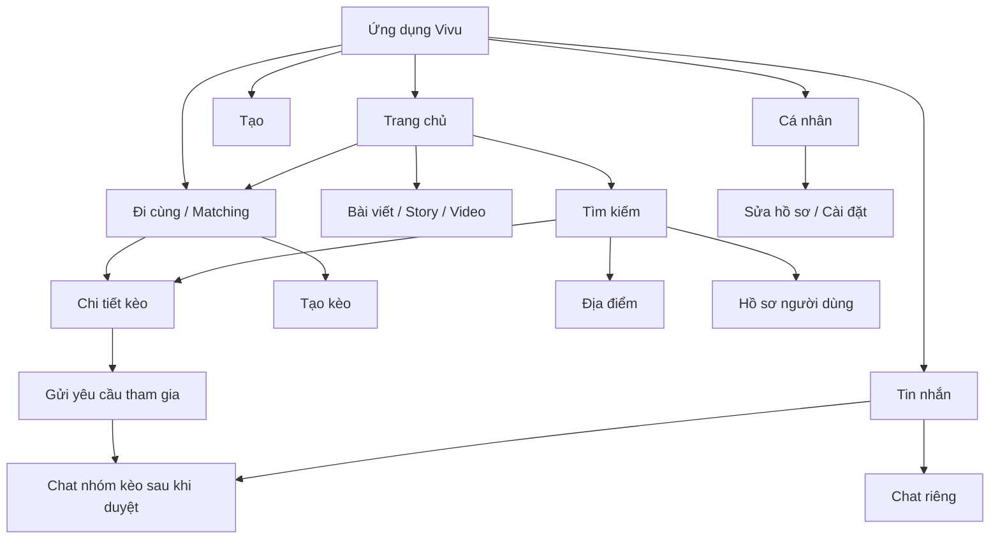

# Vivu — Đặc tả UI/UX tổng thể

**Mã tài liệu:** VIVU-UX-001  
**Phiên bản:** 1.0  
**Trạng thái:** Kim chỉ nam thiết kế, cần duyệt trước khi dùng làm chuẩn chính thức  
**Ngày cập nhật:** 2026-09-29

> Mục tiêu của tài liệu là giữ cho mọi màn hình của Vivu phục vụ cùng một lời hứa: **giúp người dùng tìm người cùng muốn đi đâu đó, vào một thời điểm cụ thể**. Feed, tìm kiếm, hồ sơ và Messenger hỗ trợ lời hứa đó; chúng không được lấn át Matching bằng quá nhiều luồng phụ.

## 1. Lời hứa và nguyên tắc thiết kế

### Lời hứa sản phẩm

**Muốn đi đâu, Vivu tìm người đi cùng.** Người dùng có thể khám phá kèo đang mở gần mình hoặc tạo kèo mới, sau đó xem ai tổ chức, lúc nào, ở đâu và còn bao nhiêu chỗ.

### Nguyên tắc UI/UX

1. **Matching là điểm nhấn:** tab “Đi cùng”/Matching có vị trí dễ tìm; kèo là đơn vị kết nối chính.
2. **Mỗi màn hình có một hành động chính:** CTA phải mô tả rõ kết quả như “Tạo kèo”, “Tham gia kèo”, “Gửi yêu cầu”.
3. **Thông tin trước cảm xúc:** giờ, khu vực, chỗ còn lại, chủ kèo và trạng thái phải dễ quét trước khi tham gia.
4. **Nêu lý do đề xuất:** thể hiện 1–2 tín hiệu phù hợp, ví dụ “Cùng mê cà phê” hoặc “Gần khu vực bạn chọn”.
5. **Tôn trọng quyền riêng tư:** vị trí chính xác, danh sách thành viên và nội dung riêng tư không hiển thị mặc định.
6. **Hỗ trợ gặp mặt an toàn:** ưu tiên địa điểm công cộng; báo cáo, chặn, rút yêu cầu và rời kèo phải dễ tìm.
7. **Ít bước, có thể quay lại:** biểu mẫu kèo ngắn; nếu cần nhiều bước thì lưu nháp và hiển thị tiến trình.
8. **Một hệ thống nhất quán:** màu sắc, từ ngữ, trạng thái, nút và điều hướng dùng chung giữa các màn hình.

## 2. Thứ tự ưu tiên trải nghiệm

Khi có xung đột giữa yêu cầu giao diện, ưu tiên theo thứ tự:

1. Người dùng hiểu kèo và biết họ đang đồng ý với điều gì.
2. Người dùng hoàn tất được hành động chính.
3. Quyền riêng tư và an toàn được giữ đúng.
4. Giao diện nhất quán và dễ đọc.
5. Tính trang trí, gamification hoặc tính năng tăng tương tác.

Không thêm màn hình, tab hoặc thành phần điều hướng nếu không giúp khám phá/tạo kèo, kết nối, phối hợp, hoặc quản lý an toàn và tài khoản.

## 3. Kiến trúc thông tin và điều hướng

### Điều hướng chính

| Tab | Vai trò | Hành động người dùng thường làm |
|---|---|---|
| Trang chủ | Nội dung cộng đồng, cảm hứng và lối vào kèo | Xem bài, lưu, bình luận, rủ đi cùng |
| Đi cùng | Matching và khám phá/tạo kèo | Chọn một kế hoạch, xem chi tiết, xin tham gia |
| Tạo | Lối tắt tạo nội dung/kèo theo ngữ cảnh | Chọn đăng bài, story hoặc tạo kèo; phải giữ Matching là lựa chọn ưu tiên |
| Tin nhắn | Trao đổi riêng và nhóm kèo | Phối hợp và xác nhận kế hoạch |
| Cá nhân | Hồ sơ, nội dung và cài đặt | Chỉnh thông tin, quyền riêng tư, xem hoạt động |

**Quy tắc:** tab đang chọn phải có nhãn và dấu hiệu thị giác rõ. Mở chi tiết/kèo/chat là điều hướng cấp dưới; quay lại phải trở về ngữ cảnh danh sách trước đó, bao gồm bộ lọc và vị trí cuộn nếu khả thi.

### Sơ đồ điều hướng

## 4. Hệ thống thiết kế

### 4.1 Màu sắc định hướng

Các giá trị dưới đây theo prototype hiện có; cần được designer duyệt và chuẩn hóa thành design tokens trước phát triển production.

| Token | Giá trị tham khảo | Cách dùng |
|---|---|---|
| Nền | `#FAF8F5` | Nền tổng thể ấm, không quá trắng |
| Bề mặt | `#FFFFFF` | Thẻ, modal, input |
| Màu chữ | `#292633` | Nội dung chính |
| Chữ phụ | `#797482` | Mô tả, thời gian, metadata |
| Coral | `#FF6B5E` | CTA chính, trạng thái đang chọn và hành động quan trọng |
| Tím | `#7559E8` | Matching, nhấn mạnh phụ, điều hướng |
| Mint | `#27B58A` | Xác nhận/thành công/trạng thái đã xác minh |
| Đường viền | `#E9E4DF` | Phân tách nhẹ |

Không dùng màu đơn lẻ để diễn tả trạng thái; kết hợp nhãn, biểu tượng hoặc mô tả.

### 4.2 Chữ và phân cấp

- Ưu tiên font sans-serif hỗ trợ tiếng Việt rõ ràng; giữ số kiểu chữ ở mức tối thiểu.
- Tiêu đề màn hình ngắn và mô tả nhiệm vụ, không dùng slogan dài lấn vùng nội dung.
- Nội dung quan trọng như thời gian, số chỗ và CTA không được đặt bằng cỡ chữ phụ.
- Dùng câu ngắn, tiếng Việt tự nhiên, nhất quán giữa “kèo”, “yêu cầu tham gia”, “chủ kèo” và “người tham gia”.

### 4.3 Hình dạng và khoảng cách

- Thẻ bo góc vừa phải; input, chip và nút dùng cùng bộ bán kính.
- Giữ khoảng cách nhất quán theo thang 4/8 px; tránh nhồi thẻ dày đặc.
- CTA chính có vùng chạm tối thiểu theo guideline nền tảng; không đặt sát mép thiết bị.
- Ảnh/gradient tạo cảm xúc, nhưng không được thay thông tin cần thiết để quyết định.

### 4.4 Thành phần dùng chung

| Thành phần | Quy tắc |
|---|---|
| Nút chính | Một CTA chính mỗi khu vực; động từ + kết quả cụ thể |
| Nút phụ | Dùng cho quay lại, xem chi tiết, lưu hoặc thao tác ít ưu tiên |
| Thẻ kèo | Hoạt động, giờ/ngày, khu vực/khoảng cách, chỗ còn, chủ kèo, lý do phù hợp, CTA |
| Avatar | Có ảnh thay thế/initials; tên truy cập được và có trạng thái riêng nếu xác minh |
| Chip lọc | Có trạng thái chọn rõ; có thể cuộn ngang; người dùng nhận biết/xóa bộ lọc đang áp dụng |
| Toast | Dùng xác nhận ngắn; lỗi cần có cách khắc phục, không chỉ biến mất |
| Empty state | Nêu nguyên nhân có thể hiểu và một hành động tiếp theo |
| Modal/sheet | Dùng cho quyết định ngắn; hành động hủy và xác nhận phân biệt rõ |
| Skeleton | Giữ cấu trúc gần nội dung đích; tránh spinner toàn màn hình nếu chỉ tải một vùng |

## 5. Đặc tả giao diện theo màn hình

Danh sách dưới đây bao gồm các màn hình trong prototype tổng thể. Một số chức năng phụ được đưa vào sau khi luồng Matching cốt lõi hoạt động ổn định.

| Mã | Màn hình | Mục đích và nội dung bắt buộc | CTA/điều hướng chính | Ưu tiên |
|---|---|---|---|---|
| UX-00 | Đăng nhập/đăng ký | Đăng nhập, tạo tài khoản, xác minh, khôi phục; quyền tùy chọn không được ép | Đăng nhập / Tạo tài khoản | P0 |
| UX-01 | Trang chủ | Nguồn cấp, story, tab feed, lối vào kèo | Rủ đi cùng / Khám phá kèo | P0 |
| UX-02 | Video dọc | Xem video, tác giả, tương tác và CTA biến trải nghiệm thành kèo | Rủ đi trải nghiệm | P2 |
| UX-03 | Tạo bài viết | Nội dung, media, địa điểm và audience | Đăng bài | P1 |
| UX-04 | Tạo Story | Media preview, chú thích, audience và thời hạn | Chia sẻ Story | P2 |
| UX-05 | Tìm kiếm | Ô tìm, lịch sử/xu hướng, phân loại người/bài/địa điểm/kèo | Mở kết quả | P0 |
| UX-06 | Khám phá địa điểm | Danh sách địa điểm, khu vực, loại hình, đánh giá | Xem địa điểm / bản đồ | P1 |
| UX-07 | Chi tiết bài viết | Nội dung, tương tác, bình luận và tạo kèo từ ngữ cảnh | Bình luận / Rủ đi cùng | P1 |
| UX-08 | Chi tiết địa điểm | Ảnh, loại, khu vực, giờ mở cửa nếu xác minh, kèo tại đây | Chỉ đường / Tạo kèo tại đây | P1 |
| UX-09 | Đánh giá địa điểm | Điểm và nhận xét có nguồn, bộ lọc đánh giá | Viết đánh giá | P2 |
| UX-10 | Người tham gia | Thành viên, trạng thái, quyền riêng tư và số chỗ | Xem hồ sơ/đóng danh sách | P1 |
| UX-11 | Matching bản đồ | Kèo trên bản đồ, bộ lọc, vùng tìm và thẻ được chọn | Xem chi tiết / Tạo kèo | P0 |
| UX-12 | Matching danh sách | Kèo xếp theo phù hợp, thời gian, khoảng cách và số chỗ | Tham gia kèo | P0 |
| UX-13 | Tạo kèo | Hoạt động, giờ, địa điểm, số chỗ, mô tả, quyền hiển thị | Đăng kèo | P0 |
| UX-14 | Chi tiết kèo | Chủ kèo, kế hoạch, thành viên, còn chỗ, thông tin an toàn | Gửi yêu cầu tham gia | P0 |
| UX-15 | Quản lý kèo | Yêu cầu chờ, thành viên, sửa, đóng, hủy và chat nhóm | Duyệt / Cập nhật kèo | P0 |
| UX-16 | Yêu cầu và lời mời | Yêu cầu nhận/gửi, lời mời và trạng thái | Chấp nhận / Từ chối / Rút | P1 |
| UX-17 | Bạn bè | Gợi ý, bạn chung, yêu cầu kết nối | Kết bạn / Xem hồ sơ | P1 |
| UX-18 | Danh sách Messenger | Search hội thoại, tin chưa đọc, preview và thời gian | Mở chat / Chat mới | P0 |
| UX-19 | Chat riêng | Tin nhắn, trạng thái gửi, composer và an toàn | Gửi tin / Báo cáo / Chặn | P0 |
| UX-20 | Chat nhóm kèo | Thành viên đã duyệt, thông tin kế hoạch ghim, cập nhật hệ thống | Nhắn tin / Mở kèo | P0 |
| UX-21 | Thông báo | Thông báo kết nối, kèo, tin nhắn; đã đọc/chưa đọc | Mở nội dung liên quan | P1 |
| UX-22 | Trợ lý Vi Vi | Hỏi đáp/gợi ý nếu được giữ trong phạm vi sản phẩm | Xem gợi ý có thể hành động | P2 |
| UX-23 | Nội dung đã lưu | Bộ lọc nội dung/bài/kèo/địa điểm đã lưu | Mở hoặc bỏ lưu | P2 |
| UX-24 | Trang cá nhân | Ảnh bìa/avatar, bio, khu vực, sở thích, thống kê, nội dung công khai | Sửa hồ sơ / Kết bạn | P0 |
| UX-25 | Sửa hồ sơ | Tên, bio, sở thích, ảnh và cài đặt hiển thị | Lưu thay đổi | P0 |
| UX-26 | Xác minh | Trạng thái, giải thích dữ liệu và bước xác minh nếu được triển khai | Bắt đầu / Xem trạng thái | P1 |

## 6. Hướng dẫn từng vùng sản phẩm

### 6.1 Trang chủ

- Trang chủ tạo cảm hứng nhưng không được biến thành feed không có đường sang hành động ngoài đời.
- Nội dung ưu tiên gồm bài có địa điểm/hoạt động và kèo liên quan.
- CTA “Rủ đi cùng” phải mở tạo kèo với dữ liệu ngữ cảnh được điền sẵn nếu có.
- Xem chi tiết tại `HOME_FUNCTIONAL_SPEC.md`.

### 6.2 Matching và kèo

- Matching là trải nghiệm cốt lõi và cần nổi bật trong điều hướng.
- Mỗi thẻ phải trả lời nhanh: làm gì, khi nào, ở đâu/gần đâu, ai tổ chức, còn mấy chỗ, vì sao phù hợp.
- Không dùng swipe hồ sơ làm cơ chế chính.
- Tạo kèo phải ngắn, có preview và cho chỉnh trước khi đăng.
- Sau khi yêu cầu được duyệt, nối mạch sang chat nhóm và thông tin kế hoạch ghim.
- Xem chi tiết tại `VIVU_MATCHING_FUNCTIONAL_SPEC.md`.

### 6.3 Messenger

- Danh sách hội thoại ưu tiên kèo đang diễn ra hoặc tin chưa đọc nhưng không gây báo động giả.
- Chat nhóm phải luôn giữ thông tin kế hoạch dễ truy cập.
- Không biến chat thành công cụ spam mời tham gia; cần giới hạn và quyền riêng tư.
- Xem chi tiết tại `MESSENGER_FUNCTIONAL_SPEC.md`.

### 6.4 Profile

- Hồ sơ cần giúp đánh giá độ tin cậy và sở thích, không phơi bày dữ liệu nhạy cảm.
- “Kèo đã tham gia” nên là tín hiệu trải nghiệm, không phải điểm số con người.
- Dấu xác minh mô tả trạng thái xác minh, không hàm ý đảm bảo an toàn tuyệt đối.
- Xem chi tiết tại `PROFILE_FUNCTIONAL_SPEC.md`.

### 6.5 Search

- Tìm kiếm phải phân biệt rõ người, nội dung, địa điểm và kèo.
- Kết quả kèo nhấn vào hoạt động, thời gian, khu vực, số chỗ và trạng thái.
- Kết quả không có quyền xem không được tiết lộ qua gợi ý hoặc snippet.
- Xem chi tiết tại `SEARCH_FUNCTIONAL_SPEC.md`.

### 6.6 Đăng ký/đăng nhập

- Đăng nhập và tạo tài khoản là hai trạng thái rõ ràng, có lối chuyển qua lại.
- Không xin quyền vị trí/danh bạ/thông báo trong bước đầu nếu chưa cần.
- Lỗi xác thực không tiết lộ email/số điện thoại có tồn tại hay không.
- Xem chi tiết tại `AUTH_FUNCTIONAL_SPEC.md`.

## 7. Luồng trải nghiệm bắt buộc

### Luồng A — Tìm và tham gia kèo

Trang chủ/Matching → lọc hoặc khám phá → thẻ kèo → chi tiết → gửi yêu cầu → chờ duyệt → thông báo chấp nhận → chat nhóm → xác nhận giờ/điểm gặp.

**Điểm kiểm soát:** trạng thái yêu cầu luôn hiển thị; không mở chat trước khi duyệt; nếu kèo vừa đủ chỗ thì giải thích và gợi ý kèo gần tương tự.

### Luồng B — Tạo kèo

CTA Tạo kèo → nhập hoạt động/ngày giờ/khu vực/số chỗ → chọn quyền hiển thị → preview → đăng → quản lý yêu cầu → duyệt → chat nhóm.

**Điểm kiểm soát:** lỗi ngay tại trường; giờ quá khứ không hợp lệ; thay đổi trọng yếu thông báo thành viên; hủy có xác nhận và giải thích hậu quả.

### Luồng C — Từ nội dung sang hoạt động

Bài viết/video/địa điểm → “Rủ đi cùng” hoặc “Tạo kèo tại đây” → biểu mẫu có context điền sẵn → người dùng rà soát → đăng kèo.

**Điểm kiểm soát:** dữ liệu context không được đăng tự động; người dùng phải thấy và xác nhận địa điểm/thời gian trước khi xuất bản.

## 8. Ngôn ngữ và microcopy

- Dùng tiếng Việt gần gũi, cụ thể, không gây áp lực.
- Dùng nhất quán: “kèo”, “chủ kèo”, “yêu cầu tham gia”, “được duyệt”, “còn chỗ”.
- Tránh CTA mơ hồ như “Tiếp tục” nếu có thể nêu hành động (“Gửi yêu cầu tham gia”).
- Lỗi mô tả cách sửa, ví dụ: “Chọn thời gian trong tương lai.”
- Trạng thái từ chối không đổ lỗi hoặc đánh giá cá nhân.
- Không khẳng định “an toàn tuyệt đối”, “đã xác thực hoàn toàn” nếu tín hiệu chỉ là xác minh cơ bản.

## 9. Trạng thái và hành vi chuẩn

Mọi màn hình có tải dữ liệu cần mô tả các trạng thái phù hợp:

| Trạng thái | Yêu cầu hiển thị |
|---|---|
| Loading | Skeleton hoặc chỉ báo trong vùng đang tải; tránh khóa toàn màn hình nếu không cần |
| Empty | Giải thích vì sao trống và đưa ra hành động tiếp theo |
| Error | Nêu điều gì thất bại, khả năng thử lại và giữ dữ liệu người dùng đã nhập |
| Offline | Hiển thị dữ liệu cũ nếu có, phân biệt với dữ liệu mới; không giả báo gửi thành công |
| Success | Xác nhận ngắn và cập nhật trạng thái ngay |
| No permission | Giải thích quyền đang thiếu và cho lựa chọn tiếp tục thủ công khi có thể |
| Disabled | Nêu điều kiện cần để hành động khả dụng |

## 10. Tiếp cận và đa thiết bị

- Hỗ trợ cỡ chữ hệ thống và zoom mà không cắt CTA/nội dung.
- Màu tương phản đủ cho văn bản; kiểm tra cả trạng thái disabled và màu coral/tím.
- Nút có nhãn truy cập được; icon không có label phải được bổ sung mô tả.
- Không dựa vào màu hoặc vị trí duy nhất để truyền đạt trạng thái.
- Hỗ trợ điều hướng bàn phím/screen reader theo nền tảng được chốt.
- Kiểm thử màn hình nhỏ, màn hình lớn và orientation được hỗ trợ.
- Chuyển động tôn trọng reduced-motion; tránh animation gây cản trở thao tác.

## 11. Những hướng thiết kế không được làm lệch

Các đề xuất thiết kế mới cần bị trả lại để chỉnh nếu:

1. Biến Matching thành vuốt hồ sơ và làm mờ kèo/hoạt động.
2. Thêm nhiều tab/chức năng phụ trước khi luồng tạo–tham gia–chốt kèo dùng được.
3. Không hiển thị thời gian, khu vực, số chỗ hoặc chủ kèo trên card/chi tiết.
4. Đưa người dùng vào chat trước khi biết họ đang tham gia kèo nào hoặc chưa được duyệt.
5. Ép bật vị trí chính xác, danh bạ hoặc thông báo để truy cập chức năng cốt lõi.
6. Công khai địa chỉ nhà riêng hoặc vị trí chính xác mặc định.
7. Tạo CTA cạnh tranh nhau, nhiều màu nhấn hoặc nhiều banner cùng lúc.
8. Dùng follower/like như thước đo tin cậy duy nhất.
9. Đặt tính năng AI/gamification lên trên nhu cầu tìm người cùng hoạt động.
10. Hiển thị số liệu, đánh giá hoặc huy hiệu giả lập như dữ liệu thật.

## 12. Checklist duyệt UI/UX

Trước khi chấp nhận màn hình hoặc luồng mới, kiểm tra:

- [ ] Màn hình phục vụ hành động nào trong lời hứa “tìm người đi cùng”?
- [ ] Hành động chính có rõ và duy nhất không?
- [ ] Người dùng có đủ dữ kiện trước khi tham gia/xuất bản không?
- [ ] Kèo và trạng thái được hiểu ngay mà không cần đoán?
- [ ] Quyền riêng tư và vị trí được xử lý minh bạch?
- [ ] Có loading, empty, error, offline và success state cần thiết?
- [ ] Có lối quay lại mà không mất ngữ cảnh?
- [ ] Báo cáo/chặn/rời kèo có thể tìm thấy?
- [ ] Giao diện nhất quán với token và thành phần dùng chung?
- [ ] Nội dung dễ đọc, thao tác được bằng một tay và tiếp cận được?
- [ ] Có bằng chứng nghiên cứu/feedback nếu đề xuất thêm chức năng mới?

## 13. Quy trình thay đổi hướng thiết kế

1. Nêu vấn đề người dùng và luồng hiện tại bị ảnh hưởng.
2. Mô tả tác động tới lời hứa sản phẩm, Matching và quyền riêng tư.
3. Tạo phương án giao diện cùng trạng thái lỗi/rỗng, không chỉ happy path.
4. Đánh giá với checklist ở Mục 12.
5. Ghi quyết định, người duyệt và cập nhật tài liệu liên quan trước khi triển khai.

Không dùng ý tưởng mới như lý do để thêm chức năng nếu chưa giải quyết một vấn đề người dùng đã xác định.

## 14. Tài liệu liên quan

- `VIVU_SRS.md` — yêu cầu hệ thống tổng thể.
- `VIVU_MATCHING_FUNCTIONAL_SPEC.md` — đặc tả Matching.
- `HOME_FUNCTIONAL_SPEC.md` — Trang chủ.
- `MESSENGER_FUNCTIONAL_SPEC.md` — Messenger.
- `PROFILE_FUNCTIONAL_SPEC.md` — Profile.
- `SEARCH_FUNCTIONAL_SPEC.md` — Tìm kiếm.
- `AUTH_FUNCTIONAL_SPEC.md` — Đăng ký/đăng nhập.
- `INFRASTRUCTURE_SPEC.md` — Cơ sở hạ tầng.
- `vivu-full-app-ui-source.html` — prototype giao diện hiện tại để tham chiếu bố cục.
